# Архитектура компьютера Отчёт по лабораторной работе №1
##  Лю Сяо НКАбд-04-24

### 1 Тема домашнего задания
	Базовая виртуальная машина Linux

### 2 Описание задачи 
анализ последовательности загрузки системы с использованием команды `dmesg`.
   -Необходимо получить информацию о версии ядра Linux, частоте процессора, модели процессора, объёме оперативной памяти, типе гипервизора, типе файловой системы корневого раздела и последовательности монтирования файловых систем.

### 3 Описание результатов выполнения задания
Вводимые команды
- `dmesg | less` – для просмотра вывода команды.
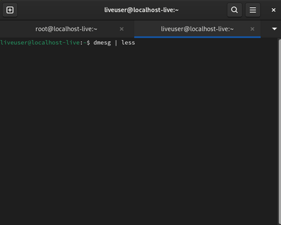
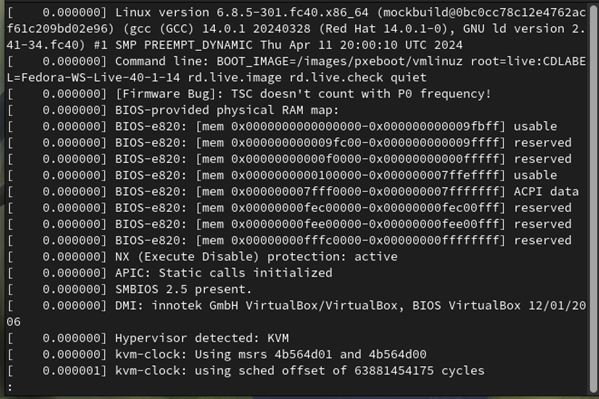
- `uname -r ` – для поиска версии ядра Linux.
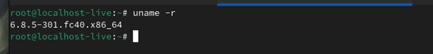
- `lscpu ` – для поиска частоты процессора.
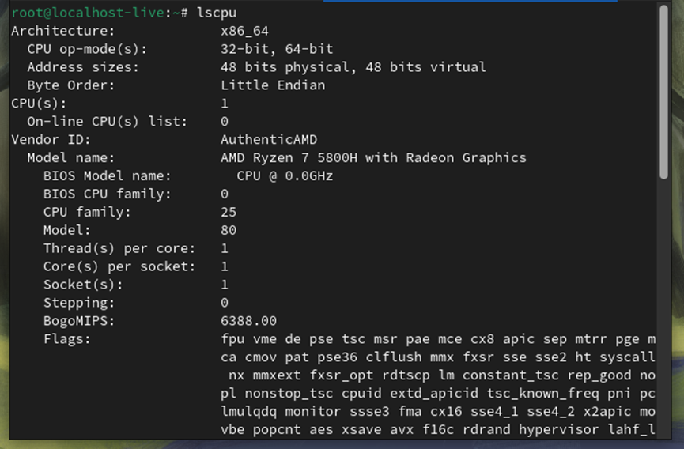
- `dmesg | grep -i "CPU0"` – для поиска модели процессора.
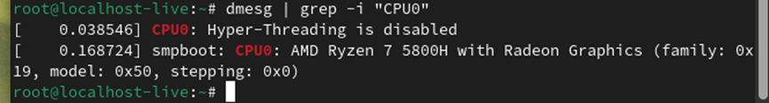
- `free -h ` – для поиска объёма оперативной памяти.
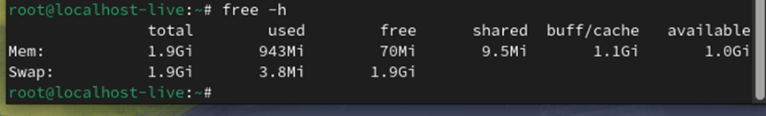
- ` systemctl status vboxservice` – для поиска типа гипервизора.
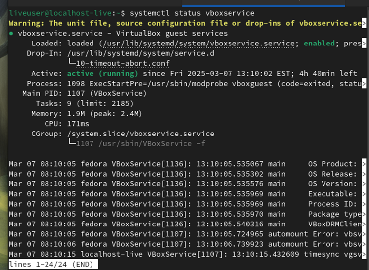
- `df -h ` `df -a` – для поиска информации о файловой системе.
 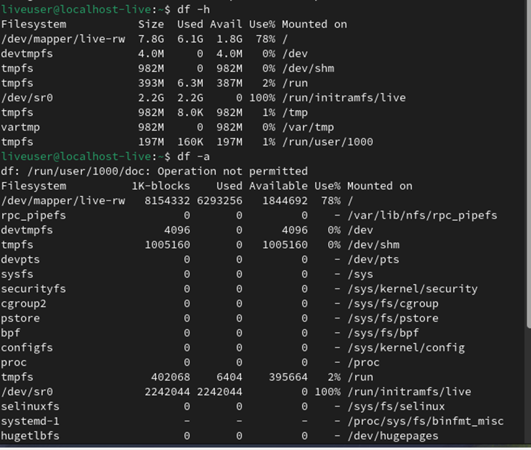
### 4 Выводы
   Краткое описание полученных данных и их значение для понимания процесса загрузки системы.

### 5 Контрольные вопросы
#### 1.	Какую информацию содержит учётная запись пользователя?
     - Учётная запись пользователя обычно содержит следующую информацию:
     - Имя пользователя (логин)
     - Пароль (или ссылка на файл с хэшем пароля)
     - Уникальный идентификатор пользователя (UID)
     - Уникальный идентификатор группы (GID)
     - Домашний каталог пользователя
     - Командная оболочка (shell) по умолчанию
     - Дополнительная информация (например, полное имя пользователя, контактные данные)
#### 2.	Укажите команды терминала и приведите примеры:
#####  для получения справки по команде;
- `команда --help` (например, `ls --help`)
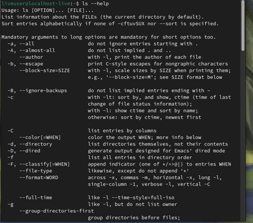
#####  для перемещения по файловой системе;
 - `cd каталог` (например, `cd /home/liveuser `)
 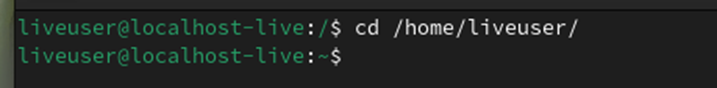
#####  для просмотра содержимого каталога;
- `ls` (например, `ls -l` для подробного вывода)
 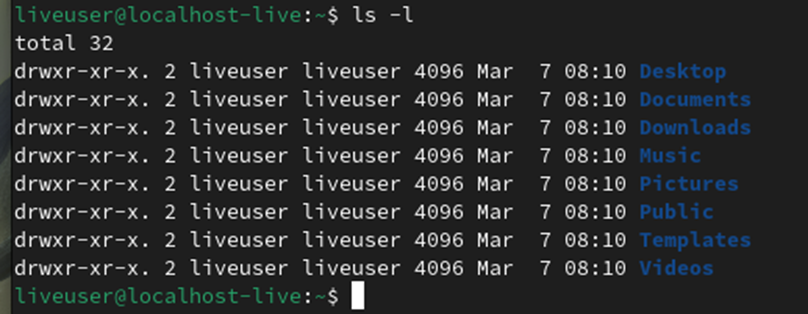
#####  для определения объёма каталога;
- `du -sh каталог` (например, `du -sh /home/ liveuser `)
 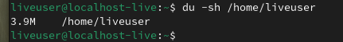
#####  для создания / удаления каталогов / файлов;
- Создание каталога: `mkdir каталог` (например, `mkdir work`)
 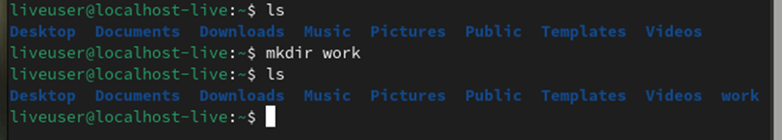
- Создание файла: `touch файл` (например, `touch work.txt`)
 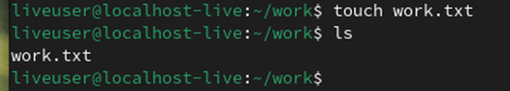
- Удаление файла: `rm файл` (например, `rm #####work.txt `)
 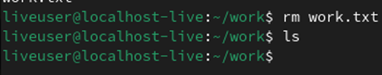
- Удаление каталога: `rmdir каталог` (например, `rmdir work`)
 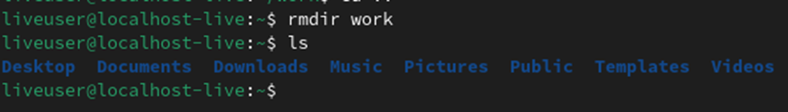
#####  для задания определённых прав на файл / каталог;
- `chmod права файл` (например, ` chmod 755 work.txt `)
 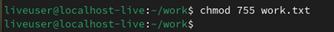
#####  для просмотра истории команд.
- `history`
 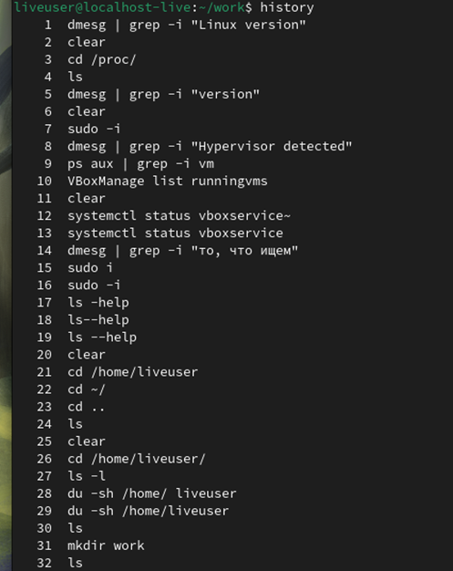
3.	Что такое файловая система? Приведите примеры с краткой характеристикой.
Файловая система — это способ организации, хранения и управления данными на носителе информации. Примеры:
     ext4 — стандартная файловая система для Linux, поддерживает журналирование и большие объёмы данных.
     NTFS — файловая система, используемая в Windows, поддерживает большие файлы и тома, а также права доступа.
     FAT32 — простая файловая система, совместимая с большинством ОС, но с ограничением на размер файла (до 4 ГБ).
     XFS — высокопроизводительная файловая система, используемая для больших данных и серверов.
4.	Как посмотреть, какие файловые системы подмонтированы в ОС?
Используйте команду `mount` или `df -h`:
     - `mount` — покажет все подмонтированные файловые системы.
     - `df -h` — покажет информацию о подмонтированных файловых системах с указанием использования дискового пространства.
5.	Как удалить зависший процесс?
   Используйте команду `kill` или `pkill`:
     Найдите идентификатор процесса (PID) с помощью `ps` или `top` (например, `ps aux | grep имя_процесса`).
     Убейте процесс по PID: `kill PID` (например, `kill 1234`).
     Если процесс не завершается, используйте принудительное завершение: `kill -9 PID`.
     Также можно использовать `pkill` для завершения процесса по имени: `pkill имя_процесса
