# Архитектура компьютера Отчёт по лабораторной работе №2
##  Лю Сяо НКАбд-04-24

### 1 Описание задачи 
Изучайте git.Завершите базовые настройки git и создайте библиотеку с помощью шаблона

### 2 Описание результатов выполнения задания
Войдите в GitHub, чтобы создать новую библиотеку и использовать шаблон.
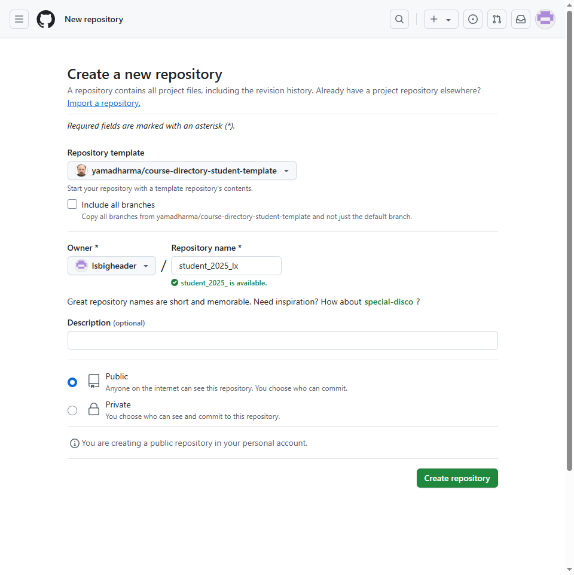
Репозиторий: https://github.com/yamadharma/course-directory-student-template.

Установить информацию git
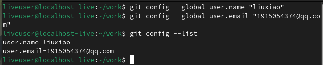

Сгенерировать shh-ключ
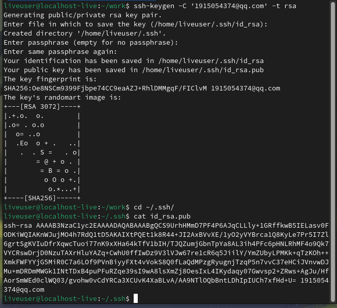

Настройте ключ: скопируйте ключ на GitHub
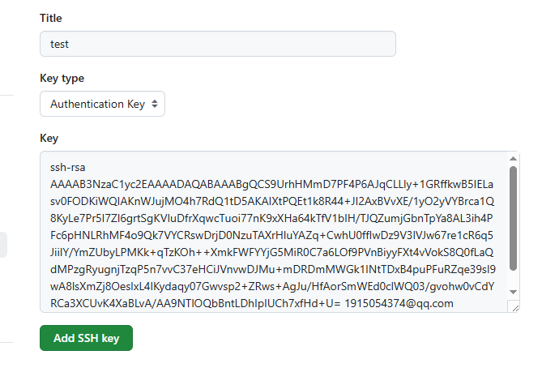

Протяните проект через ssh
git clone git@github.com:Isbigheader/student_2025_lx.git


Убедитесь, что файл обновлен.
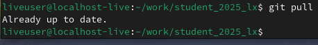

Зафиксировать файлы в github
git add .
git commit -m "tijiao"
git push
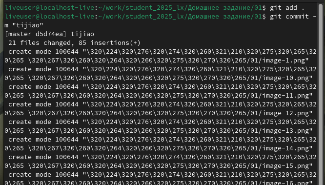
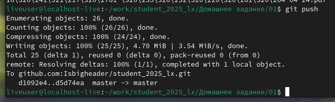

Я завершил свою первую отправку задания
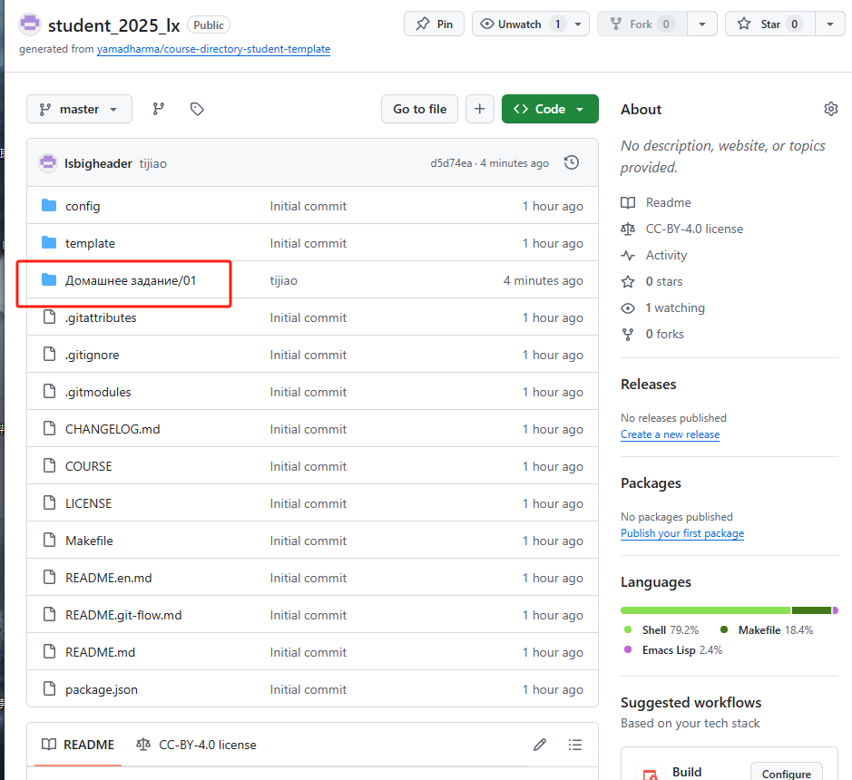
### 3 Выводы
Я научился использовать git

### 4 Контрольные вопросы
### Системы контроля версий (VCS)

**Системы контроля версий (VCS)** — это программные инструменты, которые помогают управлять изменениями в исходном коде или других файлах. Они предназначены для решения следующих задач:
- Отслеживание изменений в файлах.
- Сохранение истории изменений.
- Облегчение совместной работы над проектами.
- Возможность отката к предыдущим версиям файлов.
- Управление параллельными версиями проекта (ветками).

---

### Основные понятия VCS и их отношения

1. **Хранилище (Repository)**:
   - Это база данных, где хранятся все версии файлов, история изменений и метаданные. Хранилище может быть локальным или удалённым.

2. **Commit (Фиксация)**:
   - Это операция сохранения изменений в хранилище. Каждый коммит имеет уникальный идентификатор, сообщение и ссылку на предыдущий коммит, что формирует историю изменений.

3. **История (History)**:
   - Это последовательность коммитов, которая показывает, как файлы изменялись со временем. История позволяет отслеживать, кто, когда и какие изменения внес.

4. **Рабочая копия (Working Copy)**:
   - Это текущая версия файлов, с которыми работает пользователь. Рабочая копия может быть изменена, после чего изменения фиксируются в хранилище.

---

### Централизованные и децентрализованные VCS

1. **Централизованные VCS**:
   - Все изменения хранятся на центральном сервере. Пользователи работают с локальными копиями, но для фиксации изменений требуется подключение к серверу.
   - Примеры: **SVN (Subversion)**, **CVS (Concurrent Versions System)**.

2. **Децентрализованные VCS**:
   - Каждый пользователь имеет полную копию хранилища, включая всю историю изменений. Это позволяет работать автономно и синхронизироваться с другими репозиториями.
   - Примеры: **Git**, **Mercurial**.

---

### Действия с VCS при единоличной работе с хранилищем

1. Создание локального репозитория: `git init`.
2. Добавление файлов в отслеживание: `git add <файл>`.
3. Фиксация изменений: `git commit -m "Сообщение"`.
4. Просмотр истории изменений: `git log`.
5. Откат к предыдущей версии: `git checkout <хэш коммита>`.

---

### Порядок работы с общим хранилищем VCS

1. Клонирование удалённого репозитория: `git clone <URL>`.
2. Создание новой ветки для работы: `git branch <имя ветки>`.
3. Переключение на ветку: `git checkout <имя ветки>`.
4. Фиксация изменений: `git commit -m "Сообщение"`.
5. Отправка изменений на удалённый репозиторий: `git push origin <имя ветки>`.
6. Получение изменений от других разработчиков: `git pull`.

---

### Основные задачи, решаемые Git

1. Управление версиями файлов.
2. Организация совместной работы.
3. Создание и управление ветками.
4. Отслеживание изменений и истории.
5. Разрешение конфликтов при слиянии.

---

### Основные команды Git и их характеристики

1. **git init** — инициализация нового репозитория.
2. **git clone** — клонирование удалённого репозитория.
3. **git add** — добавление файлов в индекс для последующего коммита.
4. **git commit** — фиксация изменений в репозитории.
5. **git status** — просмотр состояния рабочей копии.
6. **git log** — просмотр истории коммитов.
7. **git branch** — управление ветками.
8. **git checkout** — переключение между ветками или коммитами.
9. **git merge** — слияние веток.
10. **git pull** — получение изменений из удалённого репозитория.
11. **git push** — отправка изменений в удалённый репозиторий.
12. **git diff** — просмотр различий между файлами или коммитами.

---

### Примеры использования Git

1. **Работа с локальным репозиторием**:
   - Создание репозитория: `git init`.
     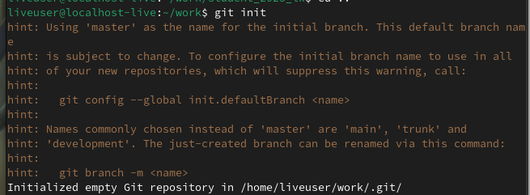
   - Добавление файла: `git add file.txt`.
     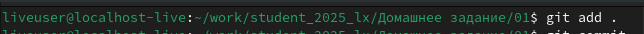
   - Коммит: `git commit -m "Добавлен file.txt"`.
     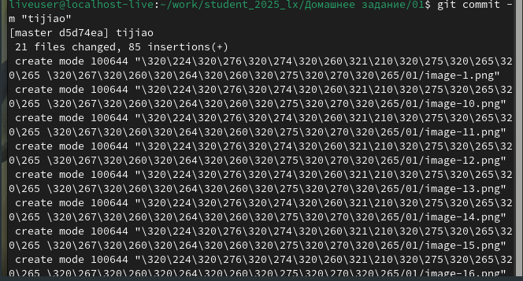
1. **Работа с удалённым репозиторием**:
   - Клонирование: `git clone git@github.com:Isbigheader/student_2025_lx.git`.
     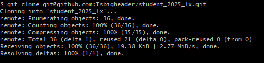
   - Отправка изменений: `git push`.
     
---

### Ветви (Branches)

**Ветви** — это отдельные линии разработки, которые позволяют работать над разными версиями проекта одновременно. Они полезны для:
- Разработки новых функций без влияния на основную версию.
- Исправления ошибок в изолированной среде.
- Параллельной работы нескольких разработчиков.

Пример:
- Создание ветки: `git branch feature`.
- Переключение на ветку: `git checkout feature`.

---

### Игнорирование файлов при коммите

Для игнорирования файлов используется файл **.gitignore**. В него добавляются шаблоны файлов или каталогов, которые не должны отслеживаться Git. Пример:
```
# Игнорировать все .log файлы
*.log

# Игнорировать каталог build
/build/
```

Это полезно для исключения временных файлов, файлов конфигурации или скомпилированных бинарников.