# Архитектура компьютера Отчёт по лабораторной работе №4
##  Лю Сяо НКАбд-04-24

### 1 Описание задачи 
  Понимать и изучать продвинутые команды git

---

### 2 Описание результатов выполнения задания
  Установка git-flow
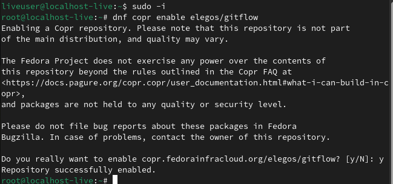
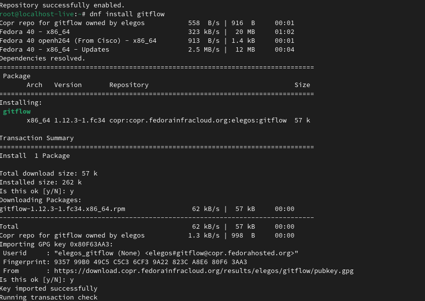
  #### 2.Установка Node.js
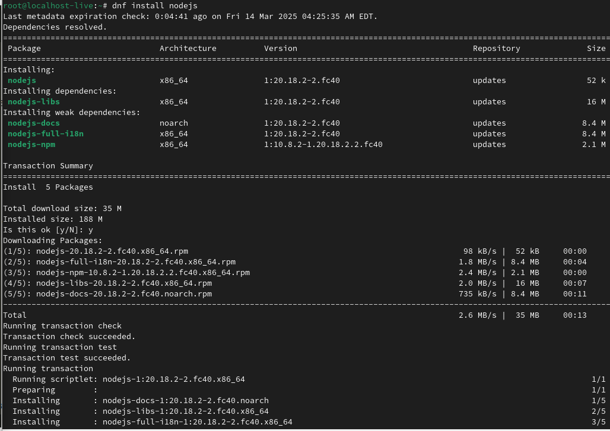
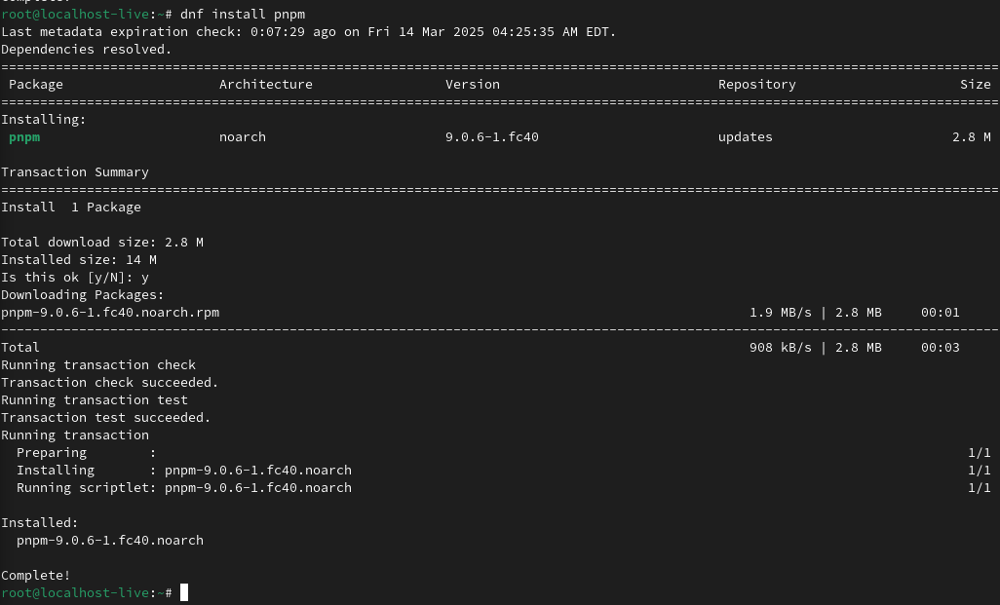

  Настройка Node.js
  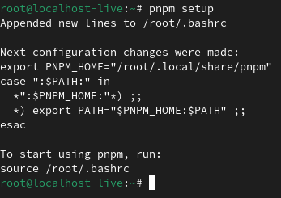

Перелогиньтесь, или выполните
  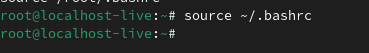

  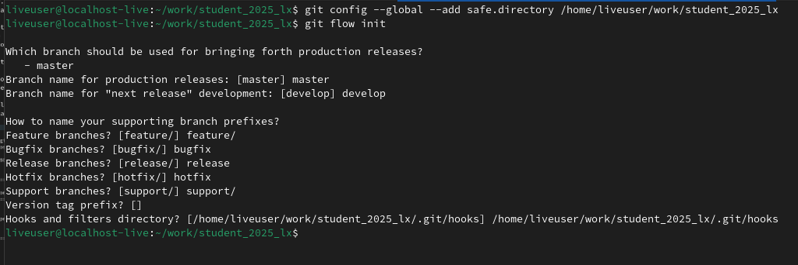

Инициализировать git-flow
  

Создать новую ветку release1.2.3
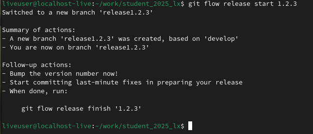
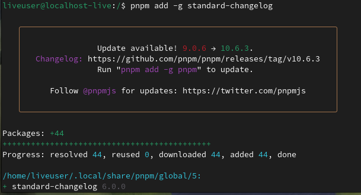

Создать журнал
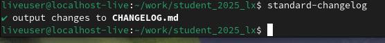

Отправить журнал
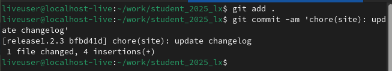

релизную ветку в основную ветку
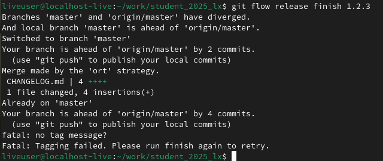

Отправим данные на github
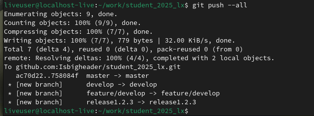

---
### 3 Выводы
Я понимаю и изучаю продвинутые команды git
### 4 Контрольные вопросы
