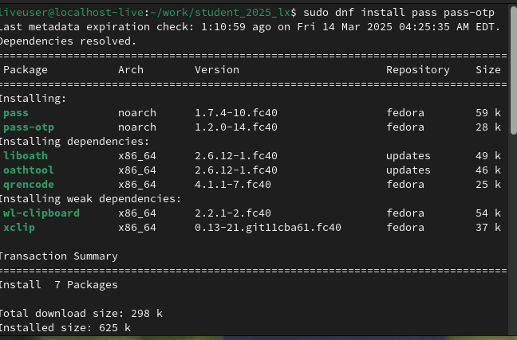

# Архитектура компьютера Отчёт по лабораторной работе №5
##  Лю Сяо НКАбд-04-24

### 1 Описание задачи 

1. **Настройка менеджера паролей `pass`**:
   - Установка `pass` и `gopass`.
   - Генерация GPG-ключа и инициализация хранилища паролей.
   - Синхронизация с Git для резервного копирования.

2. **Интеграция с графическими интерфейсами и браузерами**:
   - Установка графических интерфейсов (`qtpass`, `gopass-ui`).
   - Настройка плагина `browserpass` для браузеров.

3. **Управление конфигурациями с помощью `chezmoi`**:
   - Установка `chezmoi` и создание репозитория для конфигураций.
   - Инициализация и применение конфигураций на нескольких машинах.

4. **Установка дополнительного ПО**:
   - Установка полезных утилит и шрифтов для завершения настройки среды.

### 2 Описание результатов выполнения задания
#### 1. Установка и настройка менеджера паролей `pass`
- **Установка `pass`**
  - Fedora: `sudo dnf install pass pass-otp`
  - Другие системы: используйте соответствующий пакетный менеджер для установки `pass` и `gopass`.

- **Генерация GPG-ключа**
  - Просмотр существующих ключей: `gpg --list-secret-keys`
  - Генерация нового ключа: `gpg --full-generate-key`

- **Инициализация хранилища паролей**
  - Инициализация с использованием GPG-ключа: `pass init <gpg-id or email>`

- **Синхронизация с Git**
  - Инициализация Git-репозитория: `pass git init`
  - Добавление удаленного репозитория: `pass git remote add origin git@github.com:<git_username>/<git_repo>.git`
  - Синхронизация изменений: `pass git pull` и `pass git push`

- **Ручное управление паролями**
  - Добавление нового пароля: `pass insert [OPTIONAL DIR]/[FILENAME]`
  - Просмотр пароля: `pass [OPTIONAL DIR]/[FILENAME]`
  - Замена пароля: `pass generate --in-place FILENAME`

#### 2. Настройка графического интерфейса и интеграции с браузером
- **Установка графического интерфейса**
  - `qtpass`: графический интерфейс для `pass` и `gnupg`.
  - `gopass-ui`: графический интерфейс для `gopass`.
  - `webpass`: веб-интерфейс для `pass`.

- **Интеграция с браузером**
  - Установка плагина `browserpass`: [Firefox](https://addons.mozilla.org/en-US/firefox/addon/browserpass-ce/) или [Chrome](https://chrome.google.com/webstore/detail/browserpass-ce/naepdomgkenhinolocfifgehidddafch)
  - Установка `browserpass-native`:
    - Fedora: `sudo dnf copr enable maximbaz/browserpass && sudo dnf install browserpass`

#### 3. Использование `chezmoi` для управления конфигурационными файлами
- **Установка `chezmoi`**   
  - Установка с помощью `wget`: `sh -c "$(wget -qO- chezmoi.io/get)"`

- **Создание и управление репозиторием конфигураций**
  - Создание репозитория: `gh repo create dotfiles --template="yamadharma/dotfiles-template" --private`
  - Инициализация `chezmoi`: `chezmoi init git@github.com:<username>/dotfiles.git`
  - Проверка изменений: `chezmoi diff`
  - Применение изменений: `chezmoi apply -v`

#### 4. Установка и настройка дополнительного ПО
- **Установка полезных утилит**
  - Fedora: `sudo dnf -y install dunst fontawesome-fonts powerline-fonts light fuzzel swaylock kitty waybar swaybg wl-clipboard mpv grim slurp`

- **Установка шрифтов**
  - Включение Copr-репозитория: `sudo dnf copr enable peterwu/iosevka`
  - Установка шрифтов: `sudo dnf install iosevka-fonts iosevka-aile-fonts iosevka-curly-fonts iosevka-slab-fonts iosevka-etoile-fonts iosevka-term-fonts`

---
### 3 Выводы
Я понял и узнал 

### 4 Контрольные вопросы
