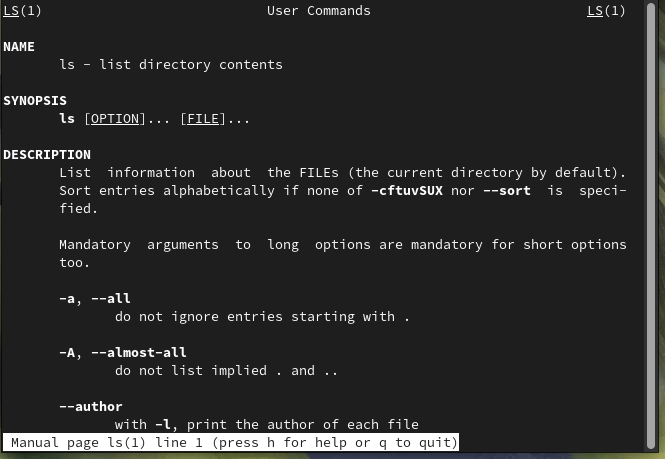

# Архитектура компьютера Отчёт по лабораторной работе №6

#### 1.Лю Сяо НКАбд-04-24

#### 2. Цель работы
- Приобретение практических навыков взаимодействия с системой Unix через командную строку.

#### 3. Результаты выполнения задания

##### 3.1 Определение полного пути домашнего каталога
- Использование команды `pwd` для определения полного пути домашнего каталога.
  ```bash
  pwd
  ```
  

##### 3.2 Работа в каталоге `/tmp`
- Переход в каталог `/tmp` с помощью команды `cd`.
  ```bash
  cd /tmp
  ```
  

- Просмотр содержимого каталога `/tmp` с использованием команды `ls` и различных опций (`-a`, `-l`, `-F`).
  ```bash
  ls
  ls -a
  ls -l
  ls -F
  ```
  
  
  
  

- Проверка наличия подкаталога `cron` в каталоге `/var/spool`.
  ```bash
  ls /var/spool | grep cron
  ```
  

- Возвращение в домашний каталог и просмотр его содержимого с определением владельца файлов и подкаталогов.
  ```bash
  cd ~
  ls -l
  ```


##### 3.3 Создание и удаление каталогов
- Создание нового каталога `newdir` в домашнем каталоге.
  ```bash
  mkdir newdir
  ```
  

- Создание подкаталога `morefun` в каталоге `newdir`.
  ```bash
  mkdir newdir/morefun
  ```
  

- Создание трёх новых каталогов `letters`, `memos`, `misk` в домашнем каталоге одной командой и их удаление.
  ```bash
  mkdir letters memos misk
  rm -r letters memos misk
  ```
  

- Попытка удаления каталога `newdir` с помощью команды `rm` и проверка результата.
  ```bash
  rm -r newdir
  ```
  

- Удаление каталога `newdir/morefun` из домашнего каталога и проверка результата.
  ```bash
  rm -r newdir/morefun
  ```
  

##### 3.4 Использование команды `man`
- Поиск опции команды `ls` для просмотра содержимого указанного каталога и его подкаталогов.
  ```bash
  man ls
  ```
  
- Поиск опции команды `ls` для сортировки по времени последнего изменения с выводом подробной информации.
  ```bash
  man ls
  ```
- Просмотр описания и основных опций команд `cd`, `pwd`, `mkdir`, `rmdir`, `rm`.
  ```bash
  man cd
  man pwd
  man mkdir
  man rmdir
  man rm
  ```


##### 3.5 Использование команды `history`
- Просмотр списка ранее выполненных команд с помощью команды `history` и модификация некоторых команд.
  ```bash
  history
  !<номер_команды>:s/<что_меняем>/<на_что_меняем>
  ```


#### 4. Выводы
- В ходе выполнения лабораторной работы я приобрел практические навыки взаимодействия с системой Unix через командную строку, изучил основные команды, такие как `cd`, `pwd`, `ls`, `mkdir`, `rm`, `history`, а также научился использовать команду `man` для получения справки по командам.

#### 5. Ответы на контрольные вопросы

1. **Что такое командная строка?**
   - Командная строка — это интерфейс взаимодействия пользователя с операционной системой, где команды вводятся в виде текстовых строк.

2. **С помощью какой команды можно определить абсолютный путь текущего каталога? Приведите пример.**
   - Используется команда `pwd`. Пример:
     ```bash
     pwd
     ```
     Результат:
     

3. **С помощью какой команды и каких опций можно определить только тип файлов и их имена в текущем каталоге? Приведите примеры.**
   - Используется команда `ls -F`. Пример:
     ```bash
     ls -F
     ```


4. **Каким образом отобразить информацию о скрытых файлах? Приведите примеры.**
   - Используется команда `ls -a`. Пример:
     ```bash
     ls -a
     ```


5. **С помощью каких команд можно удалить файл и каталог? Можно ли это сделать одной и той же командой? Приведите примеры.**
   - Для удаления файла используется команда `rm`, для удаления каталога — `rm -r`. Пример:
     ```bash
     rm file.txt
     rm -r directory
     ```

6. **Каким образом можно вывести информацию о последних выполненных пользователем командах?**
   - Используется команда `history`. Пример:
     ```bash
     history
     ```


7. **Как воспользоваться историей команд для их модифицированного выполнения? Приведите примеры.**
   - Используется конструкция `!<номер_команды>:s/<что_меняем>/<на_что_меняем>`. Пример:
     

8. **Приведите примеры запуска нескольких команд в одной строке.**
   - Используется символ `;`. Пример:
     ```bash
     cd; ls
     ```


9. **Дайте определение и приведите примеры символов экранирования.**
   - Символ экранирования `\` В Linux и многих языках программирования экранированный символ — это специальный символ, который изменяет значение последующих символов. Последовательность escape обычно начинается с `\` и сообщает системе, что следующие символы следует рассматривать как специальные или буквальные символы, а не как обычные символы. Символы экранирования являются очень важным инструментом в Linux и программировании для обработки специальных символов, представления невидимых символов и предотвращения синтаксических ошибок. Правильно используя экранированные символы, вы сможете более гибко обрабатывать сложные ситуации в именах файлов, строках и скриптах. К распространенным экранированным символам относятся `\`, `\n`, `\t` и т. д. Освоение их использования может значительно повысить эффективность работы.. Пример:
     ```bash
     cd /path/with\ spaces
     ```


10. **Охарактеризуйте вывод информации на экран после выполнения команды `ls -l`.**
    - Выводится подробная информация о файлах и каталогах, включая тип файла, права доступа, количество ссылок, владельца, размер, дату последнего изменения и имя.

11. **Что такое относительный путь к файлу? Приведите примеры использования относительного и абсолютного пути при выполнении какой-либо команды.**
    - Относительный путь указывается относительно текущего каталога. Пример:
      ```bash
      cd ../work
      cd /home/liveuser/work
      ```

12. **Как получить информацию об интересующей вас команде?**
    - Используется команда `man`. Пример:
      ```bash
      man ls
      ```


13. **Какая клавиша или комбинация клавиш служит для автоматического дополнения вводимых команд?**
    - Используется клавиша `Tab`.

---