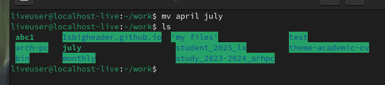

# Архитектура компьютера Отчёт по лабораторной работе №5

#### 1.Лю Сяо НКАбд-04-24

---

## 2. Цель работы
Ознакомление с файловой системой Linux, её структурой, именами и содержанием каталогов. Приобретение практических навыков по применению команд для работы с файлами и каталогами, управлению процессами, проверке использования диска и обслуживанию файловой системы.

---

## 3. Результаты выполнения задания

### 3.1. Примеры выполнения команд
#### Создание и просмотр файлов:
```bash
touch abc1                # Создание файла abc1
cat abc1                  # Просмотр содержимого файла abc1
less abc1                 # Постраничный просмотр файла abc1
head -n 5 abc1            # Просмотр первых 5 строк файла abc1
tail -n 5 abc1            # Просмотр последних 5 строк файла abc1
```


#### Копирование файлов и каталогов:
```bash
cp abc1 april             # Копирование файла abc1 в файл april
mkdir monthly             # Создание каталога monthly
cp april monthly      # Копирование файлов april  в каталог monthly
```


#### Перемещение и переименование:
```bash
mv april july             # Переименование файла april в july
mv july monthly       # Перемещение файла july в каталог monthly
mv monthly monthly01  # Переименование каталога monthly в monthly
```



#### Управление правами доступа:
```bash
chmod u+x abc1             # Добавление права на выполнение для владельца файла may
chmod g-r,o-r monthly01     # Запрет на чтение для группы и других пользователей каталога monthly
```


#### Анализ файловой системы:
```bash
mount                     # Просмотр смонтированных файловых систем
df                        # Просмотр свободного места на файловых системах
fsck /dev/sda1            # Проверка целостности файловой системы
```


---

### 3.2. Выполнение заданий

#### Задание 2:
1. Копирование файла `io.h` в домашний каталог:
   ```bash
   cp /usr/include/linux/hid.h ~/equipment/
   ```
   
2. Создание каталога `ski.plases`:
   ```bash
   mkdir ~/ski.plases
   ```
   
3. Перемещение файла `equipment` в каталог `ski.plases`:
   ```bash
   mv ~/equipment ~/ski.plases/
   ```
   
4. Переименование файла:
   ```bash
   mv ~/ski.plases/equipment ~/ski.plases/equiplist
   ```
   
5. Создание и копирование файла `abcl`:
   ```bash
   touch ~/abcl
   cp ~/abcl ~/ski.plases/equiplist2
   ```
   
   
6. Создание каталога `equipment`:
   ```bash
   mkdir ~/ski.plases/equipment
   ```
   
7. Перемещение файлов в каталог `equipment`:
   ```bash
   mv ~/ski.plases/equiplist ~/ski.plases/equiplist2 ~/ski.plases/equipment/
   ```
   
8. Создание и перемещение каталога `newdir`:
   ```bash
   mkdir ~/newdir
   mv ~/newdir ~/ski.plases/plans
   ```

#### Задание 3:
1. Для `drwxr--r--` (каталог `australia`):
   ```bash
   chmod u=rwx,g=r,o=r australia
   ```
2. Для `drwx--x--x` (каталог `play`):
   ```bash
   chmod u=rwx,g=x,o=x play
   ```
3. Для `-r-xr--r--` (файл `my_os`):
   ```bash
   chmod u=rx,g=r,o=r my_os
   ```
4. Для `-rw-rw-r--` (файл `feathers`):
   ```bash
   chmod u=rw,g=rw,o=r feathers
   ```

#### Задание 4:
1. Просмотр файла `/etc/password`:
   ```bash
   cat /etc/password
   ```
   У меня не было файла паролей, поэтому я посмотрел в файле brlapi.key
   
2. Копирование файла `feathers`:
   ```bash
   cp -r ~/feathers ~/file.old
   ```
   
3. Перемещение файла `file.old`:
   ```bash
   mv ~/file.old ~/play/
   ```
   
4. Копирование каталога `play`:
   ```bash
   cp -r ~/play ~/fun
   ```
   
5. Перемещение каталога `fun`:
   ```bash
   mv ~/fun ~/play/games
   ```
   
6. Лишение права на чтение:
   ```bash
   chmod u-r ~/feathers
   ```
   
7. Попытка просмотра файла `feathers`:
   ```bash
   cat ~/feathers  # Выведет сообщение об ошибке доступа
   ```
   
8. Попытка копирования файла `feathers`:
   ```bash
   cp -r ~/feathers ~/feathers_copy  # Выведет сообщение об ошибке доступа
   ```
   
9. Возврат права на чтение:
   ```bash
   chmod u+r ~/feathers
   ```
   
10. Лишение права на выполнение каталога `play`:
    ```bash
    chmod u-x ~/play
    ```
    
11. Попытка перехода в каталог `play`:
    ```bash
    cd ~/play  # Выведет сообщение об ошибке доступа
    ```
    
12. Возврат права на выполнение:
    ```bash
    chmod u+x ~/play
    ```

---

### 3.3. Характеристика команд
#### Команда `mount`:
- **Назначение**: Монтирование файловых систем.
- **Пример**:
  ```bash
  mount /dev/sda1 /mnt
  ```

#### Команда `fsck`:
- **Назначение**: Проверка и восстановление файловых систем.
- **Пример**:
  ```bash
  fsck /dev/sda1
  ```

#### Команда `mkfs`:
- **Назначение**: Создание файловой системы.
- **Пример**:
  ```bash
  mkfs.ext4 /dev/sdb1
  ```

#### Команда `kill`:
- **Назначение**: Завершение процессов.
- **Пример**:
  ```bash
  kill -9 1234
  ```

---

## 4. Выводы
В ходе лабораторной работы были изучены основные команды для работы с файлами и каталогами в Linux, такие как `cp`, `mv`, `chmod`, `mount`, `fsck` и другие. Приобретены навыки управления правами доступа, копирования, перемещения и переименования файлов, а также анализа файловой системы. Результаты работы подтвердили важность понимания структуры файловой системы и умения работать с командами Linux для эффективного управления файлами и каталогами.

---

## 5. Ответы на контрольные вопросы
1. **Характеристика файловых систем**:
   - `ext2/ext3/ext4`: Стандартные файловые системы Linux с поддержкой журналирования (ext3, ext4).
   - `ReiserFS`: Файловая система с эффективным использованием пространства.
   - `xfs`: Высокопроизводительная файловая система для больших файлов.
   - `fat/ntfs`: Файловые системы, используемые в Windows.

2. **Структура файловой системы**:
   - `/bin`: Основные исполняемые файлы.
   - `/etc`: Конфигурационные файлы.
   - `/home`: Домашние каталоги пользователей.
   - `/var`: Файлы переменных данных (логи, кэш).

3. **Доступность файловой системы**:
   - Файловая система должна быть смонтирована с помощью команды `mount`.

4. **Причины нарушения целостности**:
   - Неправильное завершение работы, аппаратные сбои. Для восстановления используется команда `fsck`.

5. **Создание файловой системы**:
   - Команда `mkfs` создаёт файловую систему на разделе.

6. **Команды для просмотра текстовых файлов**:
   - `cat`, `less`, `head`, `tail`.

7. **Возможности команды `cp`**:
   - Копирование файлов и каталогов с опциями (`-r` для рекурсивного копирования).

8. **Возможности команды `mv`**:
   - Перемещение и переименование файлов и каталогов.

9. **Права доступа**:
   - Определяют доступ пользователей к файлам и каталогам. Изменяются командой `chmod` (символьно или цифрово).

--- 