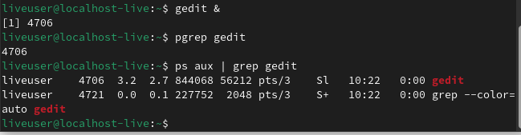

# Архитектура компьютера Отчёт по лабораторной работе №8

## 1.Лю Сяо НКАбд-04-24


## 2. Цель работы  
Ознакомление с инструментами поиска файлов и фильтрации текстовых данных. Приобретение практических навыков по управлению процессами, проверке использования диска и обслуживанию файловых систем.  

## 3. Результаты выполнения задания  

### Задание 1  
**Запись названий файлов из каталога `/etc` и домашнего каталога в файл `file.txt`.**  
```bash
ls /etc > file.txt  
ls ~ >> file.txt  
```  


### Задание 2  
**Вывод имен файлов с расширением `.conf` из `file.txt` и запись их в `conf.txt`.**  
```bash
grep "\.conf$" file.txt > conf.txt  
```  


### Задание 3  
**Поиск файлов в домашнем каталоге, имена которых начинаются с символа `c`.**  
```bash
find ~ -name "c*"  
```  

**Альтернативные варианты:**  
```bash
ls ~/c*  
```  

### Задание 4  
**Вывод имен файлов из `/etc`, начинающихся с `h`, с постраничным просмотром.**  
```bash
ls /etc/h* | less  
```  

### Задание 5  
**Запуск фонового процесса для записи файлов, начинающихся с `log`, в `~/logfile`.**  
```bash
find / -name "log*" > ~/logfile &  
```  


### Задание 6  
**Удаление файла `~/logfile`.**  
```bash
rm ~/logfile  
```  

### Задание 7  
**Запуск редактора `gedit` в фоновом режиме.**  
```bash
gedit &  
```  

### Задание 8  
**Определение идентификатора процесса `gedit`.**  
```bash
ps aux | grep gedit  
```  
**Альтернативный способ:**  
```bash
pgrep gedit  
```  

### Задание 9  
**Завершение процесса `gedit`.**  
```bash
kill [PID]  
```  

### Задание 10  
**Выполнение команд `df` и `du`.**  
```bash
df -h  
du -sh ~  
```  

### Задание 11  
**Вывод имен всех директорий в домашнем каталоге.**  
```bash
find ~ -type d  
```  


## 4. Выводы  
В ходе лабораторной работы были изучены основные команды для поиска файлов, перенаправления ввода-вывода, управления процессами и проверки использования диска. Приобретены практические навыки работы с конвейерами, фильтрацией текста и управлением задачами в Linux.  

## 5. Ответы на контрольные вопросы  

1. **Потоки ввода-вывода:**  
   - `stdin` (0) — стандартный ввод.  
   - `stdout` (1) — стандартный вывод.  
   - `stderr` (2) — стандартный вывод ошибок.  

2. **Разница между `>` и `>>`:**  
   - `>` перезаписывает файл.  
   - `>>` дописывает в конец файла.  

3. **Конвейер (`|`):**  
   Передает вывод одной команды на ввод другой.  

4. **Процесс vs программа:**  
   Программа — это исполняемый файл, а процесс — экземпляр программы во время выполнения.  

5. **PID и GID:**  
   - `PID` — идентификатор процесса.  
   - `GID` — идентификатор группы процессов.  

6. **Управление задачами:**  
   Команда `jobs` выводит список задач, а `kill` завершает их.  

7. **Утилиты `top` и `htop`:**  
   - `top` — мониторинг процессов в реальном времени.  
   - `htop` — улучшенная версия `top` с интерактивным интерфейсом.  

8. **Команда `find`:**  
   Пример:  
   ```bash  
   find /etc -name "p*"  
   ```  

9. **Поиск файла по содержимому:**  
   ```bash  
   grep -r "текст" /путь  
   ```  

10. **Объем свободной памяти:**  
    ```bash  
    df -h  
    ```  

11. **Объем домашнего каталога:**  
    ```bash  
    du -sh ~  
    ```  

12. **Удаление зависшего процесса:**  
    ```bash  
    kill -9 [PID]  
    ```