# Архитектура компьютера Отчёт по лабораторной работе №8

## Лю Сяо НКАбд-04-24

## Цель работы
Освоение основных возможностей командной оболочки Midnight Commander (mc). Приобретение навыков работы с файлами и каталогами, включая их просмотр, редактирование, копирование, перемещение и удаление, а также изучение дополнительных функций mc, таких как поиск файлов и настройка интерфейса.

## Результаты выполнения задания

### 1. Изучение структуры и меню mc
- Запустил mc командой `mc` в терминале.  
  
- Изучил двухпанельный интерфейс, верхнее меню (F9) и функциональные клавиши (F1-F10).  

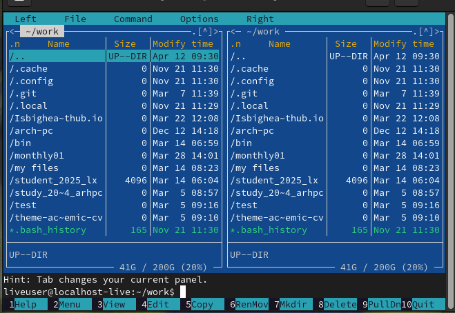

### 2. Операции с панелями
- Переставил панели местами (Ctrl+U). 
- Временно отключил панели (Ctrl+O).  
- Сравнил каталоги (Ctrl+X, D).  
  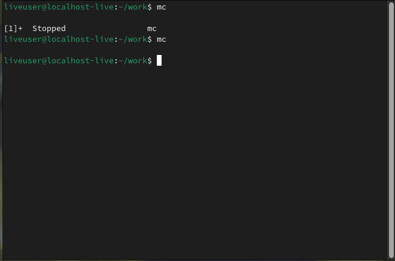
  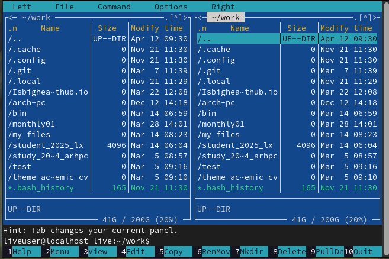 

### 3. Работа с файлами
- Создал каталог `test` (F7).  
- Скопировал файлы в созданный каталог (F5).  
- Просмотрел содержимое файла (F3).  
- Отредактировал файл (F4, без сохранения).  
  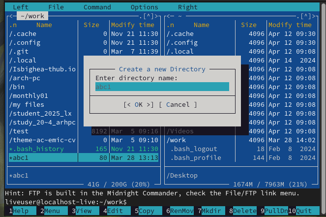
  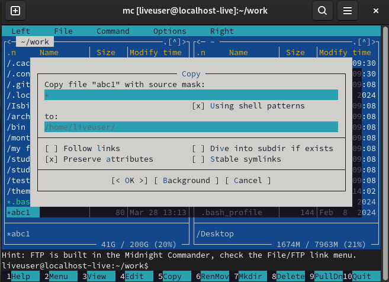
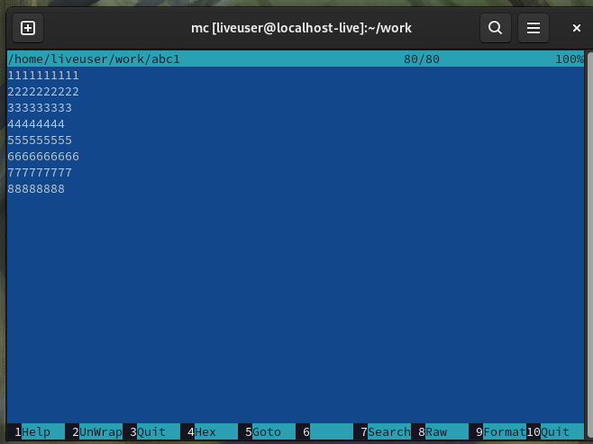
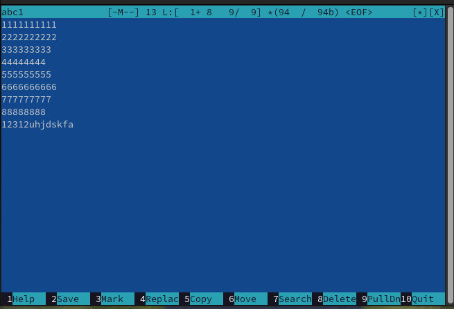
### 4. Поиск файлов
- Нашел файлы с расширением `.txt`, содержащие слово "main":  
  ```bash
  Поиск (Ctrl+S) -> Условия: *.txt + Содержит текст: main
  ```
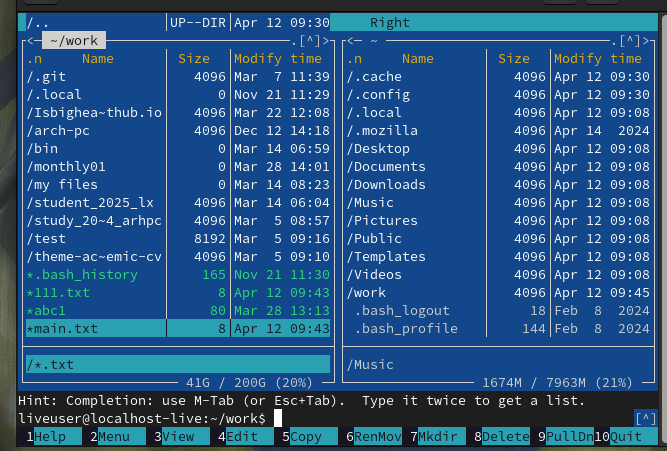 

### 5. Настройки mc
- Изменил внешний вид: включил отображение скрытых файлов (Настройки -> Внешний вид).  
- Настроил цвета (Настройки -> Расцветка имён). 
- 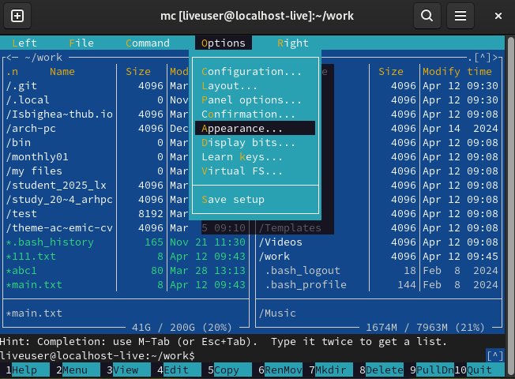 
 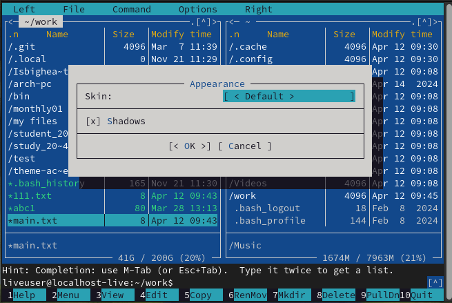

### 6. Работа со встроенным редактором
1. Создал файл `text.txt`.  
2. Вставил текст из другого файла.  
3. Выполнил действия:  
   - Удалил строку (Ctrl+Y).  
   - Скопировал фрагмент (F5).  
   - Сохранил файл (F2).  
   - Отменил действие (Ctrl+U).  
4. Включил подсветку синтаксиса для файла `program.c`.  
   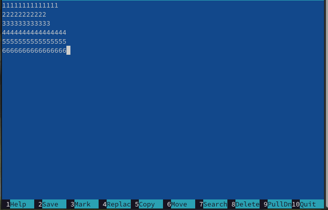
   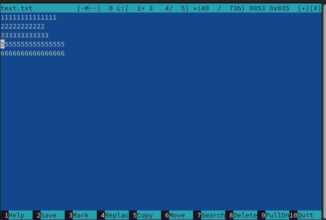
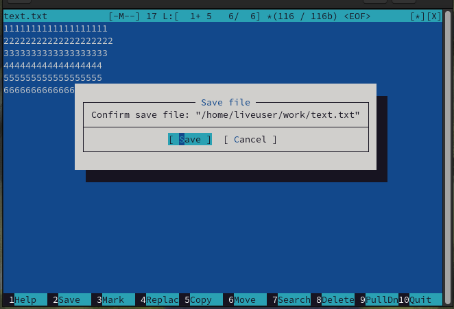
## Выводы
В ходе работы были освоены основные функции Midnight Commander:  
- Навигация по файловой системе.  
- Управление файлами и каталогами (копирование, перемещение, удаление).  
- Использование встроенного редактора для работы с текстовыми файлами.  
- Настройка интерфейса под свои нужды.  

MC является мощным инструментом для работы в терминале, сочетающим удобство графического интерфейса и гибкость командной строки.

## Ответы на контрольные вопросы


### 1. Режимы работы MC и их характеристики
MC поддерживает три основных режима отображения:

1. **Стандартный режим списка**:
   - Отображает имя файла, размер и дату изменения
   - Поддерживает сортировку по различным критериям
   - Позволяет выделять несколько файлов (клавишей Insert)

2. **Информационный режим** (F9 → Панель → Информация):
   - Показывает детальную информацию о выбранном файле:
     * Права доступа (например, -rw-r--r--)
     * Владелец и группа
     * Размер в байтах и блоках
     * Временные метки (модификации, доступа, изменения атрибутов)
     * Информация о файловой системе

3. **Режим дерева каталогов** (F9 → Панель → Дерево):
   - Отображает иерархическую структуру каталогов
   - Позволяет быстро перемещаться по файловой системе
   - Поддерживает раскрытие/сворачивание веток (клавишами + и -)

### 2. Операции с файлами: сравнение команд shell и MC
| Операция       | Команда shell | Комбинация в MC |
|----------------|---------------|-----------------|
| Копирование    | `cp`          | F5              |
| Перемещение    | `mv`          | F6              |
| Удаление       | `rm`          | F8              |
| Просмотр       | `cat`/`less`  | F3              |
| Редактирование | `vim`/`nano`  | F4              |
| Создание каталога | `mkdir`    | F7              |
| Изменение прав | `chmod`       | Ctrl+X C        |

Преимущества MC: визуальный интерфейс предотвращает ошибки ввода, поддерживает пакетные операции.

### 3. Структура меню панелей
Доступ через F9 → Левая/Правая панель:

**Форматы отображения**:
- Стандартный (имя+размер+время)
- Ускоренный (только имена в несколько столбцов)
- Расширенный (с правами и владельцем)
- Пользовательский

**Сортировка**:
- По имени
- По расширению
- По времени (модификации/доступа)
- По размеру
- Без сортировки

**Управление отображением**:
- Быстрый просмотр
- Показ скрытых файлов
- Приоритет для каталогов

### 4. Меню "Файл": полный анализ
Основные функции (F9 → Файл):

1. **Просмотр**:
   - F3 - быстрый просмотр с подсветкой синтаксиса
   - M-I - просмотр вывода команды

2. **Редактирование**:
   - F4 - встроенный редактор
   - Поддержка внешних редакторов через $EDITOR

3. **Управление правами**:
   - Ctrl+X C - изменение прав (в восьмеричном формате)
   - Ctrl+X O - смена владельца (требует root)

4. **Ссылки**:
   - Жесткие ссылки (одинаковые inode)
   - Символические ссылки (аналоги ярлыкам)

### 5. Меню "Команда": детальный обзор
Ключевые возможности (F9 → Команда):

1. **Навигация**:
   - Alt+? - дерево каталогов
   - Alt+U - история каталогов

2. **Поиск**:
   - По шаблону имени (*.txt)
   - По содержимому (аналог grep)
   - Расширенные фильтры

3. **Сравнение**:
   - Ctrl+X D - сравнение каталогов
   - Встроенная diff-утилита

4. **История**:
   - Ctrl+E - история команд
   - Быстрый доступ к часто используемым каталогам

### 6. Меню "Настройки": все параметры
Конфигурационные опции (F9 → Настройки):

1. **Интерфейс**:
   - Цветовые схемы
   - Разметка панелей
   - Поддержка мыши

2. **Поведение**:
   - Подтверждение операций
   - Настройки клавиш

3. **Виртуальные ФС**:
   - Подключение FTP/SFTP
   - Работа с архивами как с каталогами

### 7. Встроенные команды MC
1. **Управление файлами**:
   - Insert - пометка файлов
   - +/* - массовое выделение
   - - - снятие выделения

2. **Управление панелями**:
   - Ctrl+U - перестановка панелей
   - Ctrl+O - скрытие панелей

3. **Навигация**:
   - Alt+буква - быстрый переход
   - Ctrl+\ - закладки

### 8. Возможности встроенного редактора
Ключевые функции (F4):

1. **Редактирование**:
   - Ctrl+K - удаление до конца строки
   - Alt+U - отмена действий

2. **Работа с блоками**:
   - F3 - выделение
   - F5/F6 - копирование/перемещение

3. **Поддержка программирования**:
   - Подсветка синтаксиса
   - Автоотступ
   - Парные скобки

### 9. Настройка пользовательского меню
Инструкция по настройке:

1. Редактировать файл:
   ```
   ~/.local/share/mc/menu
   ```

2. Пример записи:
   ```plaintext
   + "Мои команды"
   echo "Время: $(date)" > /tmp/log
   ```

3. Расширенные возможности:
   - Переменные (%f - текущий файл)
   - Вложенные меню
   - Вызов внешних скриптов

### 10. Пользовательские действия
Механизм расширения:

1. Конфигурационный файл:
   ```
   ~/.config/mc/mc.ext
   ```

2. Пример правила:
   ```plaintext
   regex/\.py$
       Open=python %f
       View=pygmentize -g %f
   ```

3. Практическое применение:
   - Автораспаковка архивов
   - Интеграция с git
   - Статический анализ кода


