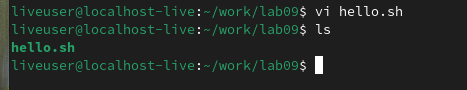
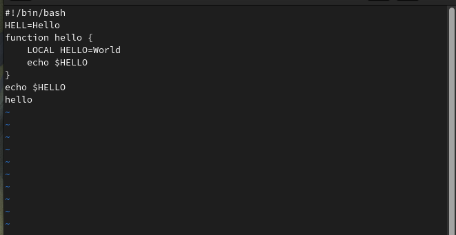
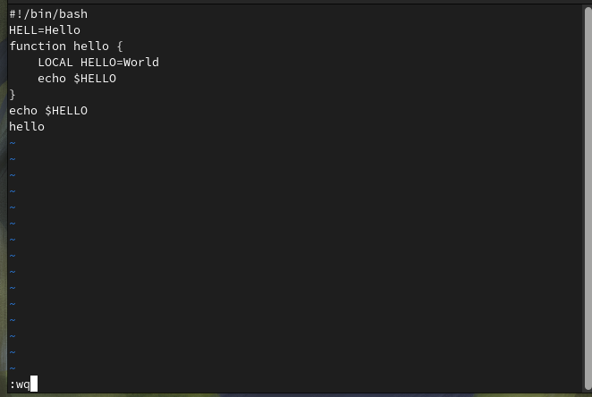
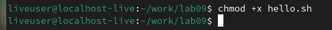
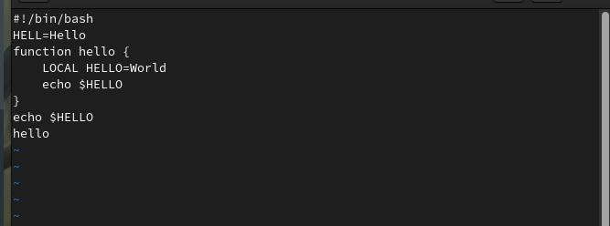
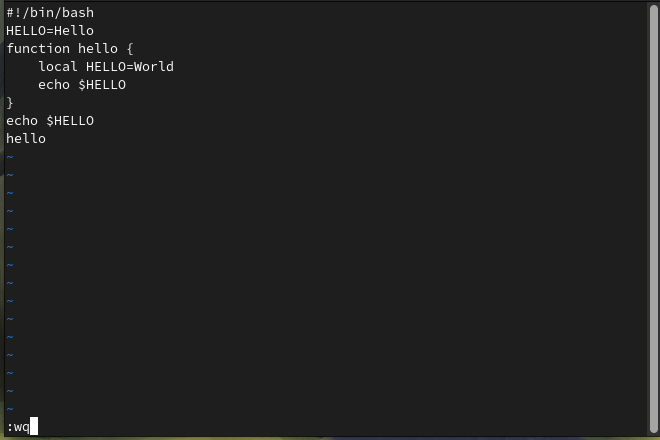

# Архитектура компьютера Отчёт по лабораторной работе №10

## Лю Сяо НКАбд-04-24


## Цель работы
Познакомиться с операционной системой Linux и получить практические навыки работы с текстовым редактором vi, который установлен по умолчанию в большинстве дистрибутивов Linux.

---

## Результаты выполнения задания

### Задание 1. Создание нового файла с использованием vi
1. Создан каталог `~/work/lab09` и осуществлен переход в него.  
2. Вызван редактор vi для создания файла `hello.sh`:  
   ```bash
   vi hello.sh
   ```
   
3. Вставлен следующий текст в режиме вставки (после нажатия `i`):  
   ```bash
   #!/bin/bash
   HELL=Hello
   function hello {
       LOCAL HELLO=World
       echo $HELLO
   }
   echo $HELLO
   hello
   ```
   
4. Текст сохранен и редактор закрыт с помощью команды `:wq`.
     
5. Файл сделан исполняемым:  
   ```bash
   chmod +x hello.sh
   ```


---

### Задание 2. Редактирование существующего файла
1. Открыт файл `hello.sh` для редактирования:  
   ```bash
   vi ~/work/lab09/hello.sh
   ```
   
2. Исправлены ошибки:  
   - Слово `HELL` заменено на `HELLO`.  
   - Удалено слово `LOCAL` и заменено на `local`.  
   - Добавлена строка `echo $HELLO` в конец файла, затем удалена и отменена с помощью команды `u`.  
3. Изменения сохранены командой `:wq`.

**Листинг исправленного файла:**  
```bash
#!/bin/bash
HELLO=Hello
function hello {
    local HELLO=World
    echo $HELLO
}
echo $HELLO
hello
```

---

## Выводы
В ходе лабораторной работы были изучены основные режимы работы редактора vi (командный, вставки и последней строки), а также освоены базовые команды для навигации, редактирования и сохранения файлов. Полученные навыки позволяют эффективно работать с текстовыми файлами в Linux без использования графических интерфейсов.

---

## Ответы на контрольные вопросы

1. **Режимы работы vi:**  
   - Командный режим: для навигации и ввода команд.  
   - Режим вставки: для ввода текста.  
   - Режим последней строки: для сохранения и выхода.  

2. **Выход без сохранения:**  
   В командном режиме ввести `:q!`.  

3. **Команды позиционирования:**  
   - `0` — начало строки.  
   - `$` — конец строки.  
   - `G` — конец файла.  
   - `nG` — переход к строке `n`.  

4. **Определение слова в vi:**  
   Для `w`/`b` — последовательность букв, цифр или знаков пунктуации. Для `W`/`B` — только пробелы, табуляции и переводы строк.  

5. **Переход в начало/конец файла:**  
   - Начало: `1G` или `gg`.  
   - Конец: `G`.  

6. **Основные команды редактирования:**  
   - Вставка: `i`, `a`, `o`.  
   - Удаление: `x`, `dw`, `dd`.  
   - Копирование/вставка: `yy`, `p`.  

7. **Заполнение строки символами $:**  
   В командном режиме: `i$$$...` (в режиме вставки).  

8. **Отмена изменений:**  
   Команда `u` отменяет последнее действие.  

9. **Команды последней строки:**  
   - `:w` — сохранить.  
   - `:q` — выйти.  
   - `:wq` — сохранить и выйти.  

10. **Определение конца строки:**  
    Команда `$` перемещает курсор в конец строки.  

11. **Опции vi:**  
    - `:set all` — список всех опций.  
    - `:set nu` — номера строк.  
    - `:set ic` — игнорировать регистр при поиске.  

12. **Определение режима:**  
    В командном режиме нажатие `Esc` возвращает в этот режим.  

13. **Граф режимов vi:**  
    ```
    Командный режим
    │
    ├── Режим вставки (i, a, o)
    └── Режим последней строки (:)
    ```