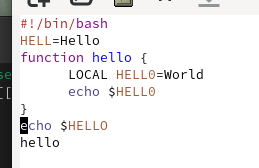

# Архитектура компьютера Отчёт по лабораторной работе №11

## Лю Сяо НКАбд-04-24

## Цель работы
Познакомиться с операционной системой Linux и получить практические навыки работы с редактором Emacs.

---

## Результаты выполнения задания

### 1. Основные команды Emacs
1. **Открытие Emacs**:  
   Запуск редактора выполнен командой `emacs` в терминале.

2. **Создание файла `lab11.sh`**:  
   Файл создан с помощью комбинации клавиш `C-x C-f` (Ctrl+x, затем Ctrl+f).  
   Введён следующий текст:  
   ```bash
   #!/bin/bash
   HELL=Hello
   function hello {
       LOCAL HELL0=World
       echo $HELL0
   }
   echo $HELLO
   hello
   ```

3. **Сохранение файла**:  
   Текст сохранён комбинацией клавиш `C-x C-s`.

4. **Редактирование текста**:  
   - Вырезана строка командой `C-k`. 

   - Вставлена строка в конец файла командой `C-y`.  

   - Выделена область текста с помощью `C-space`.  
   
   - Скопирована область в буфер обмена командой `M-w`.  
   - Вставлена область в конец файла.  
   - Вырезана выделенная область командой `C-w`.  
   - Отменено последнее действие командой `C-/`.
    
   
5. **Перемещение курсора**:  
   - В начало строки: `C-a`.  
   - В конец строки: `C-e`.  
   - В начало буфера: `M-<`.  
   - В конец буфера: `M->`.


6. **Управление буферами**:  
   - Список активных буферов выведен командой `C-x C-b`.  
   - Переключение между буферами выполнено с помощью `C-x b`.  
   - Окно со списком буферов закрыто командой `C-x 0`.


7. **Управление окнами**:  
   - Фрейм разделён на 4 части:  
     - Вертикальное разделение: `C-x 3`.  
     - Горизонтальное разделение: `C-x 2`.  
   - В каждом окне открыт новый буфер, введён текст.


8. **Режим поиска**:  
   - Поиск выполнен командой `C-s`.  
   - Переключение между результатами поиска: `C-s`.  
   - Выход из режима поиска: `C-g`.  
   - Поиск и замена: `M-%`, введён текст для замены, подтверждено символом `!`.

---

## Ответы на контрольные вопросы

1. **Характеристика Emacs**:  
   Emacs — мощный текстовый редактор с расширенными возможностями, включая редактирование кода, работу с файлами и настройку через Elisp.

2. **Сложности для новичков**:  
   - Нестандартные комбинации клавиш.  
   - Большое количество функций и режимов.  
   - Необходимость запоминания префиксов (например, `C-x`, `C-c`).

3. **Буфер и окно**:  
   - Буфер — объект, содержащий текст (например, файл или результаты команд).  
   - Окно — область фрейма, отображающая буфер.

4. **Открытие более 10 буферов**:  
   Да, в одном окне можно открыть неограниченное количество буферов, но одновременно отображается только один.

5. **Буферы по умолчанию**:  
   При запуске создаются буферы `*scratch*` и `*Messages*`.

6. **Комбинации клавиш**:  
   - `C-c |`: Удерживая Ctrl, нажать `c`, затем отпустить и нажать `|`.  
   - `C-c C-|`: Удерживая Ctrl, нажать `c`, затем, не отпуская Ctrl, нажать `|`.

7. **Разделение окна**:  
   - Горизонтально: `C-x 2`.  
   - Вертикально: `C-x 3`.

8. **Файл настроек**:  
   Настройки хранятся в файле `~/.emacs` или `~/.emacs.d/init.el`.

9. **Функция клавиши `←`**:  
   Клавиша `←` перемещает курсор назад на один символ. Её можно переназначить через файл настроек.

10. **Сравнение с Vi**:  
    Emacs показался удобнее из-за интуитивного интерфейса и расширенных возможностей настройки. В отличие от Vi, Emacs не требует переключения между режимами редактирования и команд.

---