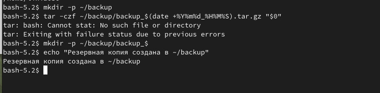
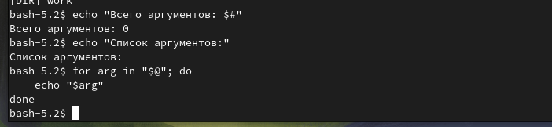
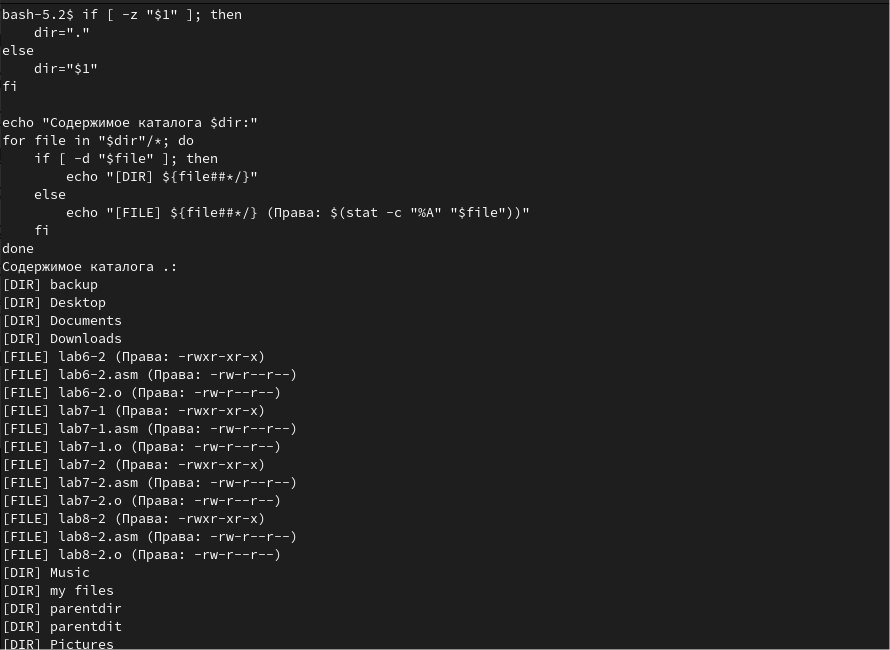
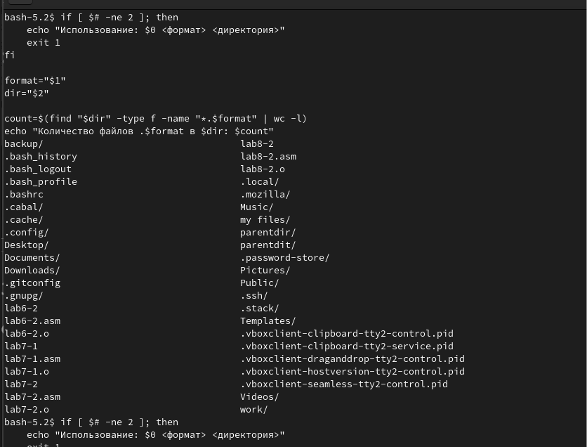

# Архитектура компьютера Отчёт по лабораторной работе №12

## Лю Сяо НКАбд-04-24


## Цель работы
Изучить основы программирования в оболочке ОС UNIX/Linux. Научиться писать небольшие командные файлы.

---

## Результаты выполнения задания

### Задание 1: Резервная копия скрипта
**Скрипт:**  
```bash
#!/bin/bash

# Создание директории backup, если её нет
mkdir -p ~/backup

# Архивирование текущего скрипта в backup
tar -czf ~/backup/backup_$(date +%Y%m%d_%H%M%S).tar.gz "$0"

echo "Резервная копия создана в ~/backup"
```

**Результат выполнения:**  
Скрипт создает архив текущего файла в директории `~/backup` с указанием даты и времени в имени файла.  

---

### Задание 2: Обработка аргументов командной строки
**Скрипт:**  
```bash
#!/bin/bash

echo "Всего аргументов: $#"
echo "Список аргументов:"
for arg in "$@"; do
    echo "$arg"
done
```
**Результат выполнения:**  
Скрипт выводит количество переданных аргументов и их список.  


---

### Задание 3: Аналог команды ls
**Скрипт:**  
```bash
#!/bin/bash

if [ -z "$1" ]; then
    dir="."
else
    dir="$1"
fi

echo "Содержимое каталога $dir:"
for file in "$dir"/*; do
    if [ -d "$file" ]; then
        echo "[DIR] ${file##*/}"
    else
        echo "[FILE] ${file##*/} (Права: $(stat -c "%A" "$file"))"
    fi
done
```

**Результат выполнения:**  
Скрипт выводит список файлов и каталогов в указанной директории с информацией о правах доступа.  

---

### Задание 4: Подсчет файлов по формату
**Скрипт:**  
```bash
#!/bin/bash

if [ $# -ne 2 ]; then
    echo "Использование: $0 <формат> <директория>"
    exit 1
fi

format="$1"
dir="$2"

count=$(find "$dir" -type f -name "*.$format" | wc -l)
echo "Количество файлов .$format в $dir: $count"
```

**Результат выполнения:**  
Скрипт подсчитывает количество файлов указанного формата в заданной директории.  


---

## Выводы
В ходе выполнения лабораторной работы были изучены основы программирования в командной оболочке bash. Были созданы скрипты для:
1. Создания резервных копий файлов.
2. Обработки аргументов командной строки.
3. Эмуляции функциональности команды `ls`.
4. Подсчета файлов по заданному формату.

Работа позволила закрепить навыки написания командных файлов, использования переменных, циклов, условий и других конструкций языка bash.

---

## Ответы на контрольные вопросы

1. **Командная оболочка** — это программа, которая обеспечивает взаимодействие пользователя с операционной системой. Примеры: Bourne shell (sh), C shell (csh), Korn shell (ksh), Bash. Отличия заключаются в синтаксисе и дополнительных возможностях.
2. **POSIX** — набор стандартов, обеспечивающих совместимость UNIX-подобных систем.
3. **Переменные** в bash определяются как `имя=значение`. **Массивы** создаются командой `set -A имя значение1 значение2`.
4. **Оператор `let`** выполняет арифметические вычисления. **Оператор `read`** считывает ввод пользователя.
5. В bash поддерживаются операции: `+`, `-`, `*`, `/`, `%`, побитовые операции и другие (см. Таблицу 10.1).
6. **Операция `(())`** используется для арифметических вычислений и проверки условий.
7. **Стандартные переменные**: `PATH`, `HOME`, `PS1`, `PS2`, `IFS`, `TERM`, `LOGNAME`.
8. **Метасимволы** — символы с особым значением в bash (например, `*`, `?`, `|`).
9. **Экранирование метасимволов** выполняется с помощью `\`, одинарных или двойных кавычек.
10. **Командные файлы** создаются как текстовые файлы с кодом bash. Запускаются командой `bash файл` или после установки прав на выполнение (`chmod +x файл`).
11. **Функции** определяются как `function имя { команды; }`.
12. Проверка типа файла: `test -f` (обычный файл), `test -d` (каталог).
13. **Команды**:  
    - `set` — управление переменными и функциями.  
    - `typeset` — объявление типов переменных.  
    - `unset` — удаление переменных или функций.
14. **Параметры** передаются через аргументы командной строки (`$1`, `$2`, ..., `$9`, `$*`, `$@`).
15. **Специальные переменные**:  
    - `$?` — код завершения последней команды.  
    - `$$` — PID текущего процесса.  
    - `$!` — PID последнего фонового процесса.  
    - `$#` — количество аргументов.  
    - `$*` и `$@` — все аргументы.  
