# Архитектура компьютера Отчёт по лабораторной работе №13

## Лю Сяо НКАбд-04-24

## Цель работы
Изучить основы программирования в оболочке ОС UNIX, научиться писать сложные командные файлы с использованием логических управляющих конструкций и циклов.

## Результаты выполнения задания

### Задание 1: Командный файл с ключами для поиска строк
Создайте файл search.sh：
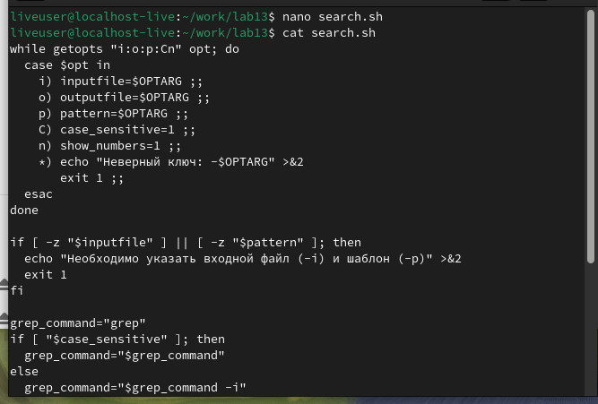
**Листинг программы:**
```bash
#!/bin/bash

while getopts "i:o:p:Cn" opt; do
  case $opt in
    i) inputfile=$OPTARG ;;
    o) outputfile=$OPTARG ;;
    p) pattern=$OPTARG ;;
    C) case_sensitive=1 ;;
    n) show_numbers=1 ;;
    *) echo "Неверный ключ: -$OPTARG" >&2
       exit 1 ;;
  esac
done

if [ -z "$inputfile" ] || [ -z "$pattern" ]; then
  echo "Необходимо указать входной файл (-i) и шаблон (-p)" >&2
  exit 1
fi

grep_command="grep"
if [ "$case_sensitive" ]; then
  grep_command="$grep_command"
else
  grep_command="$grep_command -i"
fi

if [ "$show_numbers" ]; then
  grep_command="$grep_command -n"
fi

if [ "$outputfile" ]; then
  $grep_command "$pattern" "$inputfile" > "$outputfile"
else
  $grep_command "$pattern" "$inputfile"
fi
```

Установить разрешения:
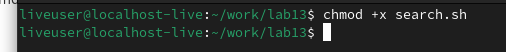

Создайте тестовый файл:
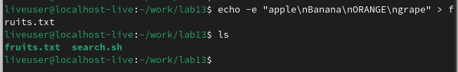

Запустите тесты:
# Поиск без учета регистра
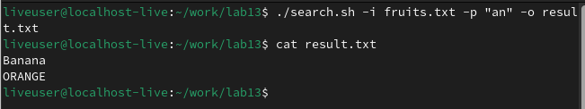
# Поиск с учетом регистра по номеру строки
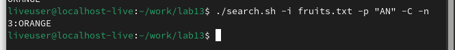


**Результат выполнения:**  
Программа успешно анализирует командную строку, ищет строки по шаблону в указанном файле и выводит результат с учетом ключей (-C для учета регистра, -n для вывода номеров строк). Результат может быть сохранен в файл, если указан ключ -o.

---

### Задание 2: Программа на Си для определения знака числа

Создайте check_number.c：
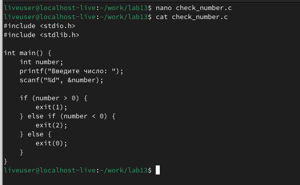
**Листинг программы:**
```c
#include <stdio.h>
#include <stdlib.h>

int main() {
    int number;
    printf("Введите число: ");
    scanf("%d", &number);

    if (number > 0) {
        exit(1);
    } else if (number < 0) {
        exit(2);
    } else {
        exit(0);
    }
}
```
Скомпилируйте программу:
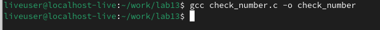

Напишите сценарий вызова:
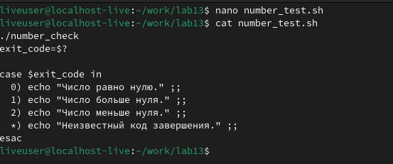

**Командный файл для анализа кода завершения:**
```bash
#!/bin/bash

./number_check
exit_code=$?

case $exit_code in
  0) echo "Число равно нулю." ;;
  1) echo "Число больше нуля." ;;
  2) echo "Число меньше нуля." ;;
  *) echo "Неизвестный код завершения." ;;
esac
```

Тестовый прогон:
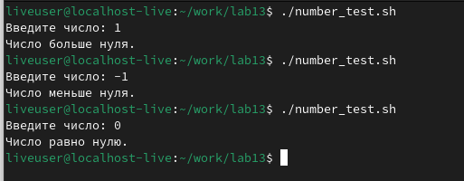

**Результат выполнения:**  
Программа корректно определяет знак введенного числа и передает информацию через код завершения. Командный файл анализирует код и выводит соответствующее сообщение.

---

### Задание 3: Командный файл для создания и удаления файлов

Создайте сценарий:
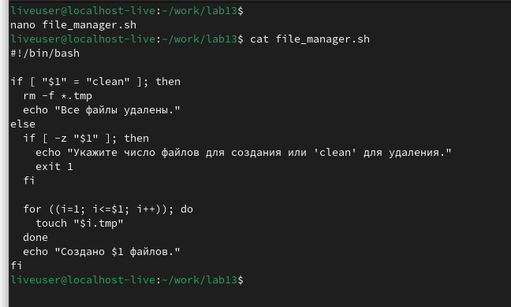
**Листинг программы:**
```bash
#!/bin/bash

if [ "$1" = "clean" ]; then
  rm -f *.tmp
  echo "Все файлы удалены."
else
  if [ -z "$1" ]; then
    echo "Укажите число файлов для создания или 'clean' для удаления."
    exit 1
  fi

  for ((i=1; i<=$1; i++)); do
    touch "$i.tmp"
  done
  echo "Создано $1 файлов."
fi
```
Файл создания теста:
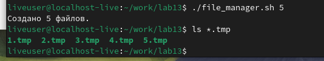
Тестовое удаление файлов:
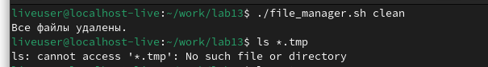

**Результат выполнения:**  
Программа создает указанное количество файлов с именами от 1.tmp до N.tmp. При передаче аргумента "clean" все файлы удаляются.

---

### Задание 4: Командный файл для архивации файлов
Создать файл сценария:
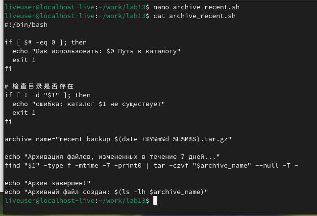

**Листинг программы:**
```bash
#!/bin/bash

if [ $# -eq 0 ]; then
  echo "Как использовать: $0 Путь к каталогу"
  exit 1
fi

# 检查目录是否存在
if [ ! -d "$1" ]; then
  echo "ошибка: каталог $1 не существует"
  exit 1
fi

archive_name="recent_backup_$(date +%Y%m%d_%H%M%S).tar.gz"

echo "Архивация файлов, измененных в течение 7 дней..."
find "$1" -type f -mtime -7 -print0 | tar -czvf "$archive_name" --null -T -

echo "Архив завершен!"
echo "Архивный файл создан: $(ls -lh $archive_name)"
```
Установить разрешения на выполнение:
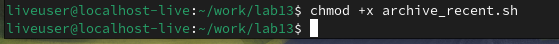

Подготовка тестовой среды:
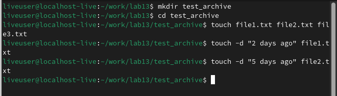

Запустить тестовый сценарий:
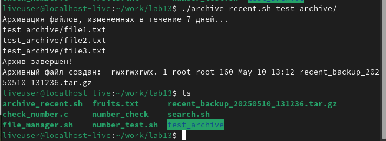
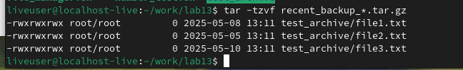
**Результат выполнения:**  
Программа создает архив с файлами из указанной директории, которые были изменены менее недели назад. Имя архива включает текущую дату.

## Выводы
В ходе лабораторной работы были изучены основы программирования в оболочке UNIX, включая использование управляющих конструкций (ветвления и циклов), обработку аргументов командной строки, а также взаимодействие с файлами и архивами. Все задачи выполнены успешно, программы работают корректно.

## Ответы на контрольные вопросы
1. **Команда getopts** предназначена для обработки аргументов командной строки в скриптах.  
2. **Метасимволы** (например, `*`, `?`) используются для генерации имен файлов путем сопоставления шаблонов.  
3. **Операторы управления действиями:** `if`, `case`, `for`, `while`, `until`.  
4. **Операторы для прерывания цикла:** `break` (прерывает цикл), `continue` (переходит к следующей итерации).  
5. **Команды false и true** возвращают соответствующий код завершения (1 и 0), что полезно для управления потоком выполнения.  
6. **Строка `if test -f man$s/$i.$s`** проверяет, существует ли файл с именем, составленным из переменных `s` и `i`.  
7. **Различия между `while` и `until`:**  
   - `while` выполняет цикл, пока условие истинно.  
   - `until` выполняет цикл, пока условие ложно.  
