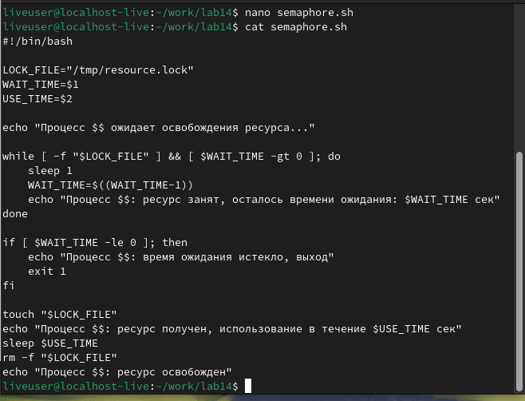
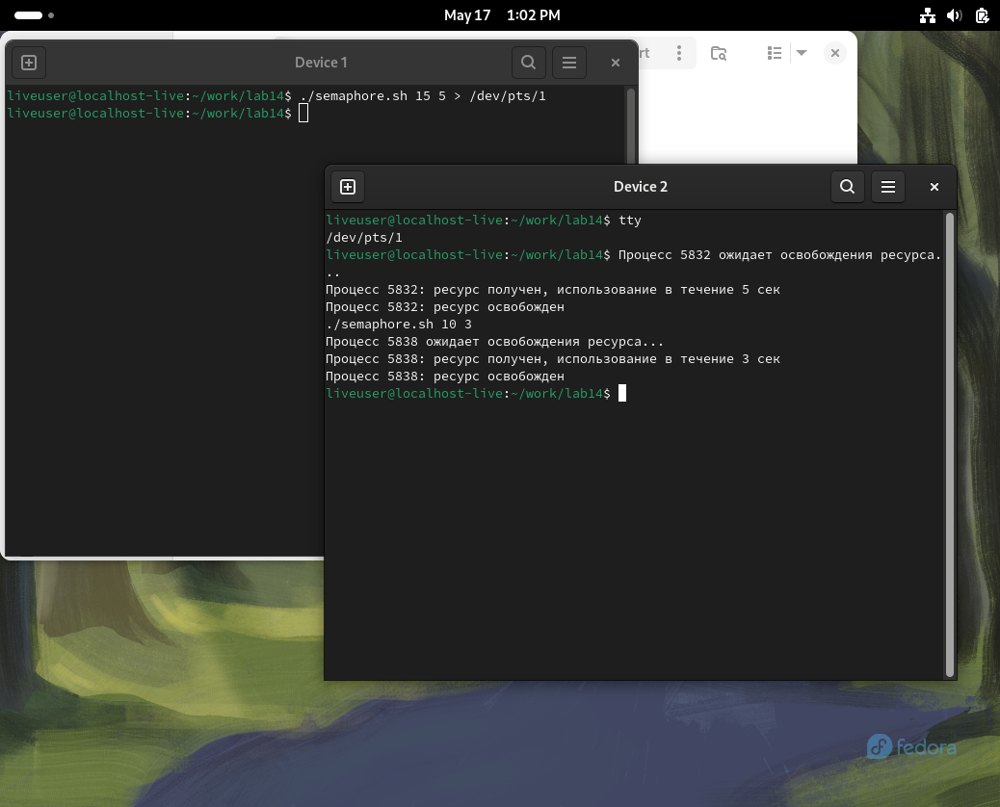
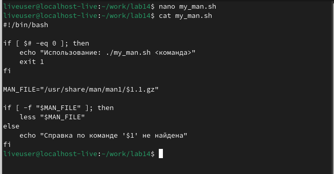
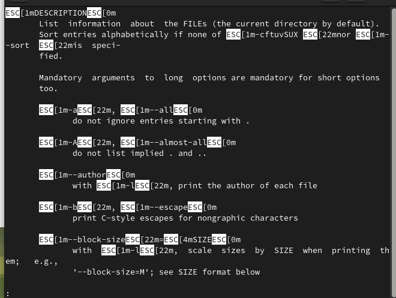
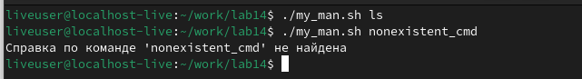
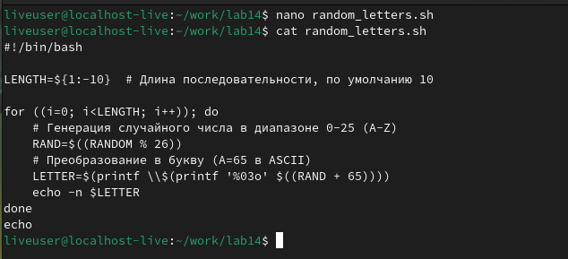
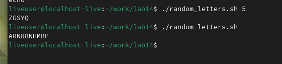

# Архитектура компьютера Отчёт по лабораторной работе №14

## Лю Сяо НКАбд-04-24

## Цель работы
Изучить основы программирования в оболочке ОС UNIX. Научиться писать более сложные командные файлы с использованием логических управляющих конструкций и циклов.

## Результаты выполнения задания

### Задание 1: Упрощённый механизм семафоров

**Листинг программы:**
```bash
#!/bin/bash

LOCK_FILE="/tmp/resource.lock"
WAIT_TIME=$1
USE_TIME=$2

echo "Процесс $$ ожидает освобождения ресурса..."

while [ -f "$LOCK_FILE" ] && [ $WAIT_TIME -gt 0 ]; do
    sleep 1
    WAIT_TIME=$((WAIT_TIME-1))
    echo "Процесс $$: ресурс занят, осталось времени ожидания: $WAIT_TIME сек"
done

if [ $WAIT_TIME -le 0 ]; then
    echo "Процесс $$: время ожидания истекло, выход"
    exit 1
fi

touch "$LOCK_FILE"
echo "Процесс $$: ресурс получен, использование в течение $USE_TIME сек"
sleep $USE_TIME
rm -f "$LOCK_FILE"
echo "Процесс $$: ресурс освобожден"
```
**Результаты теста:**


### Задание 2: Реализация команды man

**Листинг программы:**
```bash
#!/bin/bash

if [ $# -eq 0 ]; then
    echo "Использование: ./my_man.sh <команда>"
    exit 1
fi

MAN_FILE="/usr/share/man/man1/$1.1.gz"

if [ -f "$MAN_FILE" ]; then
    less "$MAN_FILE"
else
    echo "Справка по команде '$1' не найдена"
fi
```


**Результаты выполнения:**

**Проверьте, что команда не существует::**


### Задание 3: Генерация случайной последовательности букв

**Листинг программы:**
```bash
#!/bin/bash

LENGTH=${1:-10}  # Длина последовательности, по умолчанию 10

for ((i=0; i<LENGTH; i++)); do
    # Генерация случайного числа в диапазоне 0-25 (A-Z)
    RAND=$((RANDOM % 26))
    # Преобразование в букву (A=65 в ASCII)
    LETTER=$(printf \\$(printf '%03o' $((RAND + 65))))
    echo -n $LETTER
done
echo
```

**Результаты выполнения:**
```bash
./random_letters.sh 5  
./random_letters.sh   
```


## Ответы на контрольные вопросы

1. Синтаксическая ошибка: отсутствуют пробелы внутри квадратных скобок. Правильный вариант:
   ```bash
   while [ "$1" != "exit" ]
   ```

2. Конкатенация строк в bash:
   ```bash
   str1="Hello"
   str2="World"
   result="$str1 $str2"  # "Hello World"
   ```

3. Утилита `seq` генерирует последовательность чисел. Альтернативы в bash:
   ```bash
   # С использованием фигурных скобок
   echo {1..10}
   # С использованием цикла
   for i in $(seq 1 10); do echo $i; done
   ```

4. Результат выражения `$((10/3))` будет 3 (целочисленное деление).

5. Основные отличия zsh от bash:
   - Более развитое автодополнение
   - Расширенные возможности подстановки
   - Лучшая обработка массивов
   - Поддержка плавающей арифметики

6. Синтаксис конструкции верен. Это стандартный цикл for в стиле C.

7. Сравнение bash с другими языками:
   - Преимущества: простота работы с процессами и файлами, встроенная в ОС
   - Недостатки: медленнее компилируемых языков, менее строгий синтаксис

## Выводы
В ходе лабораторной работы были изучены основы программирования в командном процессоре UNIX. Были освоены методы работы с управляющими конструкциями, циклами и системными вызовами. Приобретены навыки создания более сложных командных файлов, включая реализацию механизма семафоров, аналога команды man и генератора случайных последовательностей. Полученные знания позволяют эффективно автоматизировать задачи в среде UNIX.