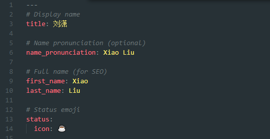
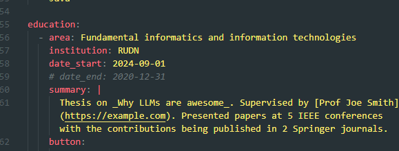
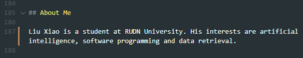
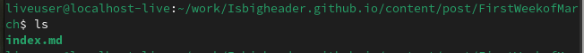
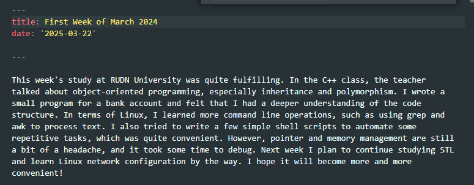
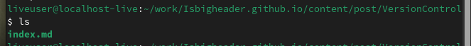
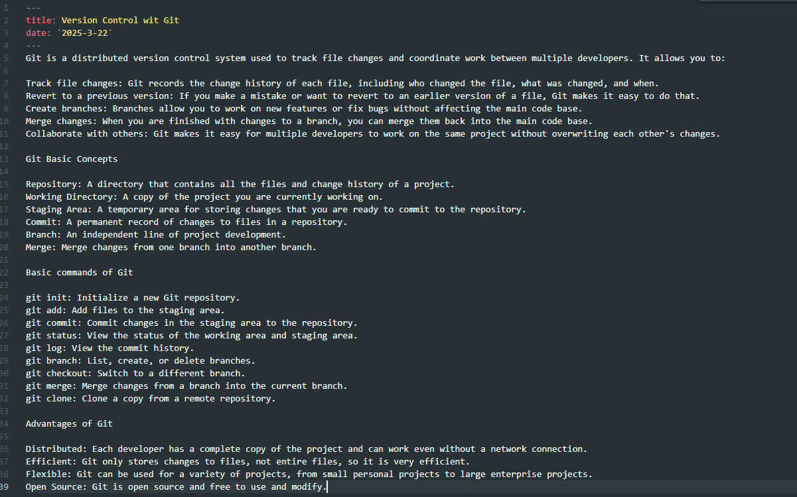

# Индивидуальный проект Персональный сайт научного работника 
##  Лю Сяо НКАбд-04-24

### 1 Описание задачи 
1. Добавлять данные:
    1. Разместить фотографию владельца сайта
    2. Разместить краткое описание владельца сайта
    3. Добавить информацию об интересах
    4. Добавить информацию об образовании
2. Сделать пост по прошедшей неделе
3. Сделать пост по теме "Управление версиями GIT" 

---

### 2 Описание результатов выполнения задания

#### Добавлять данные:

### Пост по прошедшей неделе

Я перехожу в катклог ~/work/Isbigheader.github.io/content/post/FirstWeekofMarch и создаю новую папку. Создаю файл index.md:

Я редактирую файл и добавляю информацию по прошедшей неделе

### Пост по теме "Управление версиями GIT"

Создаю ещё одну новую папку в ~/work/Isbigheader.github.io/content/post/VersionControl. Создаю файл index.md:

Я редактирую файл и добавляю информацию об управлении версиями GIT (Что это такое и как работает):

После сохранения изменении, я отправляю все на github:
