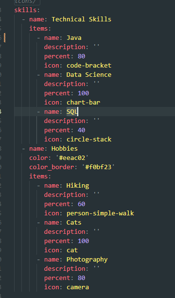
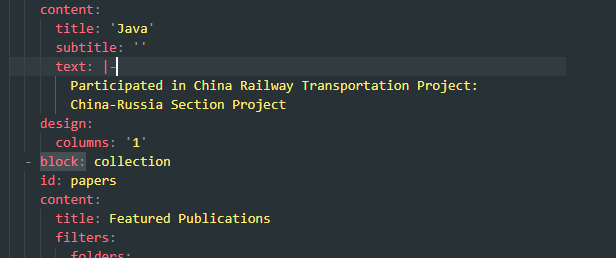
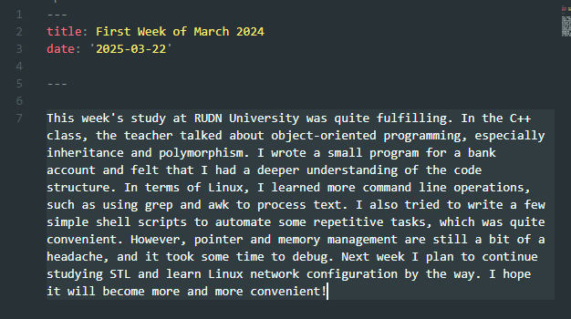
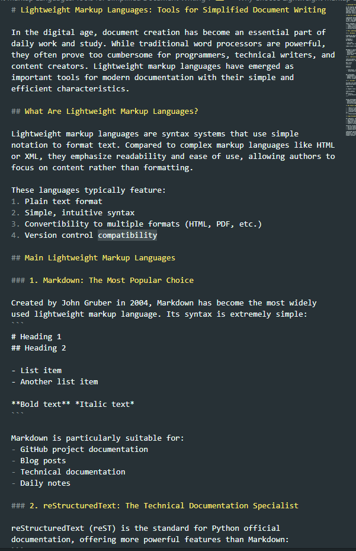

# Индивидуальный проект Персональный сайт научного работника 
##  Лю Сяо НКАбд-04-24

## Цель работы
Цель данной работы является добавлением к сайту достижения.
---
## Задание
- 1.Список достижения:
- 2.Добавить информацию о навыках
- 3.Добавить информацию об опыте
- 4.Добавить информацию о достижениях
- 5.Сделать пост по прошедщей неделе
- 6.Сделать пост на тему по выбору

## Выполнение лабораторной работы

### Добавить информацию о навыках
Далее я перешла в какталог ~/work/blog/content/authors/admin и редактировала файл _index.md:

### Добавить информацию об опыте
Чтобы добавить информацию об опыте, я перешла в ~/work/blog/content и открыла файл _index.md для редактировния:

Я создала папку lastweekofMarch и в ней вставила файл index.md:
Затем я редактировала файл index.md:

Пост на тему по выбору
Я создала папку Markdown и в ней вставила  файл markdown.md:
Затем я редактировала файл markdown.md:

### Выводы
При выполнении данной работы я освоила размещение информацию на сайт.