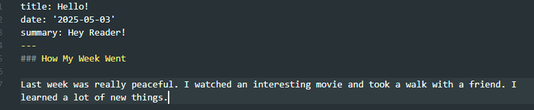

# Индивидуальный проект Персональный сайт научного работника 
##  Лю Сяо НКАбд-04-24

## Цель работы
Добавить к сайту ссылки на научные и библиометрические ресурсы.
---
## Задание
- 1.Разместить ссылки на научные и библиометрические ресурсы
- 2.Сделать пост по прошедшей неделе
- 3.Добавить пост по оформлению отчета

## Выполнение лабораторной работы

### Разместить ссылки на научные и библиометрические ресурсы
 я перешла в каталог ~/work/blog/content/admin и редактировала файл _index.md (добавила ссылки):
 
 После этого я проверила выполнение работы на локальном сервере:
 

 ### Сделать пост по прошедшей неделе
 Для того чтобы добавить к сайту пост по прошедшей неделе, я создала каталог /firstweekofApril,создала index.md:
 

 Я написала некоторый текст в index.md который, как предполагается, является содержимым по вышеупомянутой теме:
 

 ### Добавить пост по оформлению отчета
 Создала ещё один каталог с файлом index.md и изображением:
 
Я написала некоторый текст в index.md и сохранила файл:
 

## Выводы
При выполнении данной работы я освоила дабавление ссылок на сайт, созданный с помощью hugo