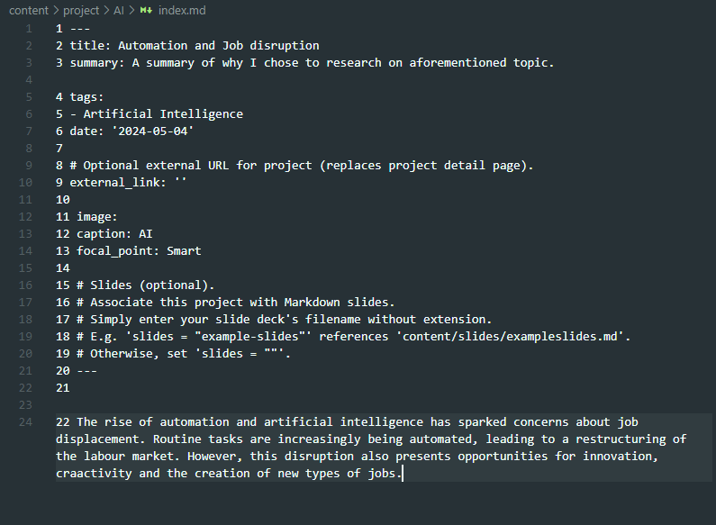
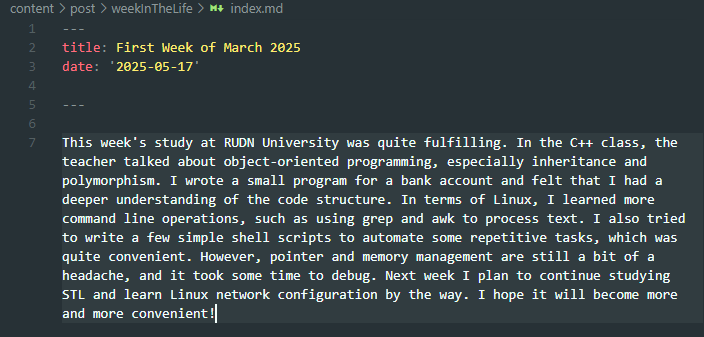
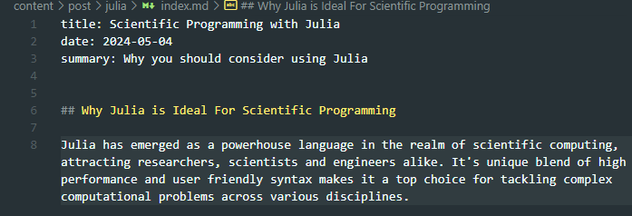

# Индивидуальный проект Персональный сайт научного работника 
##  Лю Сяо НКАбд-04-24

## Цель работы
Отредактировать сайт.
---
## Задание
- 1.Добавить проект
- 2.Добавить пост по прошедшей неделе
- 3.Добавить пост на тему по выбору

## Выполнение лабораторной работы

### Добавить проект
Я перешeл в каталог ~/blog/content/project и создала каталог AI в этом каталоге создал index.md. Написал некоторый текст в этом файле и сохранил изменения:

### Добавить пост по прошедшей неделе
Переше л в ~/blog/content/post и создал новый каталог. В нем  создал index.md. В написал о неделе и сохранил изменения:

### Добавить пост на тему по выбору
Создал еще один новый каталог и в нем вставил контент о научном языке программирования Julia:

## Выводы
